# Projeto ERP — CRMoveis

> Sistema de gestão (ERP) para imobiliária de venda e locação de imóveis, com CRM integrado ao WhatsApp e ao N8N e módulos de negociação e financeiro. Entrega final do Projeto Integrador de Modelagem de Dados: do problema real ao modelo conceitual.

## Sumário

- [1. Identificação da equipe](#1-identificação-da-equipe)
- [2. Caracterização da empresa](#2-caracterização-da-empresa)
- [3. Justificativa da escolha](#3-justificativa-da-escolha)
- [4. Problemas identificados](#4-problemas-identificados)
- [5. Processos de negócio](#5-processos-de-negócio)
- [6. Requisitos funcionais](#6-requisitos-funcionais)
- [7. Requisitos não funcionais](#7-requisitos-não-funcionais)
- [8. Regras de negócio](#8-regras-de-negócio)
- [9. Restrições e políticas organizacionais](#9-restrições-e-políticas-organizacionais)
- [10. Fluxogramas](#10-fluxogramas)
- [11. Entidades](#11-entidades)
- [12. Atributos](#12-atributos)
- [13. Relacionamentos](#13-relacionamentos)
- [14. Cardinalidades](#14-cardinalidades)
- [15. Dicionário de dados conceitual](#15-dicionário-de-dados-conceitual)
- [16. DER](#16-der)
- [17. Justificativas técnicas](#17-justificativas-técnicas)
- [18. Conclusão](#18-conclusão)
- [Arquivos do repositório](#arquivos-do-repositório)

## 1. Identificação da equipe

**Disciplina:** Projeto Integrador — Modelagem de Dados · **Professor:** Clóvis

| Integrante | RGM |
|---|---|
| Gustavo Amorim | 47296445 |
| Giovanni Corrêa Rodrigues | 46997741 |
| Julio Cesar Ferreira do Nascimento | 48915050 |
| Anderson da Silva | 49170694 |
| Fellipe da Eira Aguiar | 47521503 |
| Leonardo Vinicius de Farias | 46921613 |
| Guilherme Lucas Correa | 47520078 |
| João Vitor Candido Cassiano | 49218751 |
| Kayky Fernandes de Andrade | 47331801 |
| Gabriel Rocha da Silva | 47134313 |
| Davi Costa Ferraz | 47892153 |

## 2. Caracterização da empresa

| Item | Descrição |
|---|---|
| **Nome** | Imobiliária de pequeno porte, tratada no projeto como “a imobiliária”; a solução proposta pela equipe chama-se **CRMoveis** |
| **Segmento** | Imobiliária de pequeno porte, com atuação em venda e locação de imóveis residenciais e comerciais |
| **O que oferece** | Intermediação de venda, intermediação de locação e administração de aluguéis (cobrança do inquilino e repasse ao proprietário) |
| **Principais clientes** | Pessoas que querem comprar ou alugar um imóvel, proprietários que querem vender ou alugar, e inquilinos de imóveis administrados |
| **Principais setores** | Atendimento e vendas (corretores), captação de imóveis, administração de locações, financeiro e gestão |
| **Informações importantes** | Clientes e proprietários, imóveis e suas características, histórico de atendimento, visitas, propostas, contratos, financiamentos, comissões, contas a receber e contas a pagar |

**Como funciona hoje.** Hoje o primeiro contato do cliente acontece pelo WhatsApp de cada corretor. Os imóveis ficam cadastrados no IMOBIZI, mas visitas e propostas são anotadas em planilhas ou no próprio celular. Quando uma venda ou locação é fechada, a comissão é calculada à mão, o andamento do financiamento é acompanhado por fora e as contas a pagar e a receber ficam em uma planilha separada. Na locação, o aluguel recebido e o repasse ao proprietário também são controlados manualmente.

## 3. Justificativa da escolha

Escolhemos uma imobiliária de venda e locação porque o negócio reúne processos bem definidos e interligados — atendimento de clientes, captação de imóveis, visitas, propostas, contratos, financiamento e repasses mensais — que hoje ficam espalhados entre WhatsApp, planilhas e o sistema de anúncios. Isso gera clientes esquecidos, cadastros duplicados, comissões calculadas à mão e pouca visão do que entra e sai do caixa, o que mostra uma necessidade real de integração e torna o caso adequado a um sistema ERP. O caso também é adequado à modelagem de dados porque reúne relacionamentos N:N com informações próprias (visita, proposta e comissão), entidades que dependem de outras (fotos, documentos, baixas financeiras) e um módulo financeiro com regras próprias.

| O manual pede que a empresa tenha… | No caso da imobiliária |
|---|---|
| processos que possam ser analisados | Cinco processos principais, do primeiro contato ao repasse do aluguel (seção 5) |
| problemas de organização das informações | Treze problemas levantados, de cadastro duplicado a comissão calculada à mão (seção 4) |
| necessidade de integração | Atendimento, imóveis, negociação e financeiro dependem uns dos outros |
| possibilidade de aplicação de um ERP | Um sistema único cobre cadastro, funil, contratos e financeiro |

## 4. Problemas identificados

| Problema | Consequência | Necessidade | Requisitos que respondem |
|---|---|---|---|
| Atendimento feito no WhatsApp pessoal de cada corretor | O histórico se perde quando o corretor sai e o cliente pode ser atendido duas vezes | Centralizar conversas e mensagens por cliente | RF03, RF05, RF06, RF11, RF12 |
| O mesmo cliente cadastrado em planilha, no IMOBIZI e no celular | Duplicidade e dados desencontrados | Cadastro único de pessoas | RF01, RF03, RF14 |
| Proprietário que também quer comprar é tratado como duas pessoas | Informação duplicada e contatos errados | Uma pessoa com vários papéis | RF02 |
| Visitas e propostas anotadas em papel ou planilha | Não se sabe quantas visitas viram proposta; retrabalho | Registrar visitas e propostas ligadas ao cliente e ao imóvel | RF18, RF19, RF32 |
| Não existe visão do funil de vendas | Clientes esquecidos e sem acompanhamento | Funil com estágios e histórico de mudanças | RF07–RF10, RF30 |
| Comissões calculadas manualmente | Erros de valor e conflitos entre corretores | Comissão com percentual e regra de pagamento | RF22, RF28 |
| Financiamento acompanhado fora do sistema | Comissão paga antes de o banco liberar o crédito | Registrar o financiamento e a data de liberação | RF23, RF24 |
| Contas a pagar e a receber em planilha separada | Difícil saber quanto entra, quanto sai e quem deve pagar | Contas a receber e a pagar com responsável e baixas | RF24–RF26, RF29, RF31 |
| Repasse do aluguel controlado à mão | Atraso no repasse ao proprietário | Gerar todo mês o aluguel e, após o recebimento, o repasse | RF25, RF27 |
| Relatórios montados manualmente | Demora e informação desatualizada | Relatórios de funil e financeiros a partir dos dados | RF30–RF32 |
| Imóveis, fotos e documentos ficam no IMOBIZI ou em pastas, sem ligação com proprietário, corretor e interessados | Difícil sugerir imóvel compatível e saber quem responde por ele | Cadastro de imóveis integrado ao IMOBIZI e ligado a proprietário, corretor e conversas | RF04, RF13–RF17, RF21 |
| Cancelamento de contrato sem controle: cobranças e comissões continuam abertas | Valores cobrados ou pagos indevidamente | Cancelar o contrato com data e motivo e encerrar as pendências | RF20, RF33 |
| Não se sabe quem alterou contratos e valores, nem como atender pedidos de exclusão de dados | Conflitos sem rastro e risco de descumprir a LGPD | Registro de auditoria e anonimização de dados pessoais | RF34, RF35 |

## 5. Processos de negócio

### P1 — Atendimento de um novo contato pelo WhatsApp

| | |
|---|---|
| **Quem participa** | Cliente, automação N8N e corretor |
| **O que inicia** | O cliente manda mensagem no WhatsApp da imobiliária |
| **O que acontece** | O sistema identifica o cliente pelo telefone (ou o cadastra), abre ou retoma a conversa, registra a mensagem, interpreta a demanda, sugere imóveis compatíveis ou cria uma tarefa para o corretor e posiciona a conversa no funil |
| **Informação gerada** | Usuário, telefone, conversa, mensagens, execução da automação, interesse em imóveis, histórico do funil e tarefa |
| **Resultado** | O contato fica registrado, atendido e posicionado no funil |
| **Fluxograma** | [F1](#f1--atendimento-de-um-novo-contato-pelo-whatsapp) |

### P2 — Captação de imóvel

| | |
|---|---|
| **Quem participa** | Proprietário e corretor |
| **O que inicia** | O proprietário procura a imobiliária para vender ou alugar |
| **O que acontece** | O proprietário é cadastrado (ou tem o papel acrescentado), o imóvel é registrado com endereço, características e fotos, a documentação é conferida e um corretor responsável é definido |
| **Informação gerada** | Usuário com papel proprietário, imóvel, características, fotos e tarefa de pendência |
| **Resultado** | O imóvel é publicado como disponível |
| **Fluxograma** | [F2](#f2--captação-de-imóvel) |

### P3 — Visita e proposta

| | |
|---|---|
| **Quem participa** | Cliente, corretor e proprietário |
| **O que inicia** | O cliente pede para visitar um imóvel |
| **O que acontece** | O sistema verifica se o imóvel está disponível, agenda a visita, registra a realização e o feedback, registra a proposta e as contrapropostas até o aceite |
| **Informação gerada** | Visita, feedback, proposta e contraproposta |
| **Resultado** | Proposta aceita, pronta para virar contrato |
| **Fluxograma** | [F3](#f3--visita-e-proposta) |

### P4 — Venda: contrato, financiamento e comissão

| | |
|---|---|
| **Quem participa** | Comprador, proprietário (vendedor), corretor, banco e financeiro |
| **O que inicia** | Uma proposta de venda é aceita |
| **O que acontece** | O contrato é gerado como rascunho e passa a valer na assinatura; se houver financiamento, ele é registrado e acompanhado até a liberação do crédito; a corretagem vira conta a receber; quando a condição da regra de pagamento é atendida e o administrador aprova, a comissão é paga ao corretor; se o contrato for cancelado, registram-se data e motivo e as pendências financeiras são canceladas |
| **Informação gerada** | Contrato, documentos, financiamento, conta a receber, recebimento, comissão, conta a pagar, pagamento, registro de auditoria e, se houver, cancelamento do contrato |
| **Resultado** | Imóvel vendido, corretagem recebida e comissão paga (ou contrato cancelado e pendências encerradas) |
| **Fluxograma** | [F4](#f4--venda-contrato-financiamento-e-comissão) |

### P5 — Locação: ciclo mensal do aluguel

| | |
|---|---|
| **Quem participa** | Inquilino, proprietário e financeiro |
| **O que inicia** | Todo mês, enquanto o contrato de locação estiver vigente |
| **O que acontece** | O sistema gera a conta a receber do aluguel, acompanha o pagamento do inquilino e registra o recebimento; só então retém a taxa de administração, gera o repasse ao proprietário e o paga em até 5 dias úteis |
| **Informação gerada** | Conta a receber do aluguel, recebimento, conta a pagar do repasse e pagamento |
| **Resultado** | O proprietário recebe o repasse e a imobiliária fica com a taxa de administração |
| **Fluxograma** | [F5](#f5--locação-ciclo-mensal-do-aluguel) |

## 6. Requisitos funcionais

O que o sistema deve fazer. A coluna *Fluxo* indica em qual fluxograma o requisito aparece; o traço (—) marca requisito transversal ou de consulta, que não é etapa de nenhum fluxo.

### Pessoas

| Código | Requisito | Fluxo | Entidades |
|---|---|---|---|
| RF01 | O sistema deverá cadastrar usuários com nome, documento (CPF/CNPJ), e-mail e origem do contato. | F1, F2 | USUARIO |
| RF02 | O sistema deverá permitir que um mesmo usuário exerça mais de um papel: cliente, proprietário, inquilino, corretor, financeiro, fornecedor, administrador ou instituição financeira. | F1, F2 | USUARIO (papel) |
| RF03 | O sistema deverá registrar um ou mais telefones por usuário e identificar o usuário pelo número do WhatsApp. | F1 | TELEFONE |
| RF04 | O sistema deverá registrar os perfis de interesse do cliente: finalidade, tipo de imóvel, cidade, bairro, faixa de valor e quartos. | F1 | PERFIL_INTERESSE |

### Atendimento e funil

| Código | Requisito | Fluxo | Entidades |
|---|---|---|---|
| RF05 | O sistema deverá receber as mensagens do WhatsApp, por meio do N8N, e registrá-las na conversa do cliente. | F1 | CONVERSA, MENSAGEM |
| RF06 | O sistema deverá abrir uma nova conversa ou retomar a conversa existente do cliente. | F1 | CONVERSA |
| RF07 | O sistema deverá posicionar cada conversa em um estágio do funil de vendas e permitir movê-la entre estágios. | F1 | FUNIL_ESTAGIO |
| RF08 | O sistema deverá registrar cada mudança de estágio, com data, hora e usuário responsável. | F1 | HISTORICO_ESTAGIO |
| RF09 | O sistema deverá permitir classificar conversas com etiquetas (tags). | — | TAG |
| RF10 | O sistema deverá criar tarefas para os corretores, com prazo e situação, ligadas ou não a uma conversa. | F1, F2, F4 | TAREFA |
| RF11 | O sistema deverá interpretar a demanda do cliente e sugerir automaticamente imóveis compatíveis com o perfil de interesse. | F1 | AUTOMACAO_EXECUCAO, CONVERSA_IMOVEL |
| RF12 | O sistema deverá registrar cada execução da automação e os eventos técnicos de cada execução. | F1 | AUTOMACAO_EXECUCAO, AUTOMACAO_LOG |

### Imóveis

| Código | Requisito | Fluxo | Entidades |
|---|---|---|---|
| RF13 | O sistema deverá cadastrar imóveis com endereço, características, finalidade (venda, locação ou ambas), valores de venda e/ou de aluguel e situação. | F2 | IMOVEL, CARACTERISTICA |
| RF14 | O sistema deverá importar e atualizar os imóveis a partir do IMOBIZI. | F2 | IMOVEL |
| RF15 | O sistema deverá anexar fotos aos imóveis, na ordem de exibição. | F2 | FOTO |
| RF16 | O sistema deverá registrar o proprietário e o corretor responsável de cada imóvel. | F2 | IMOVEL, USUARIO |
| RF17 | O sistema deverá registrar os imóveis de interesse de cada conversa. | F1 | CONVERSA_IMOVEL |

### Negociação

| Código | Requisito | Fluxo | Entidades |
|---|---|---|---|
| RF18 | O sistema deverá agendar, registrar a realização e cancelar visitas, guardando o feedback do cliente. | F3 | VISITA |
| RF19 | O sistema deverá registrar propostas e contrapropostas, ligadas ou não a uma visita, guardando o valor anunciado do imóvel no momento da proposta e ligando cada contraproposta à proposta que ela responde. | F3 | PROPOSTA |
| RF20 | O sistema deverá gerar o contrato de venda ou de locação a partir de uma proposta aceita, com percentual de corretagem ou taxa de administração. | F3, F4 | CONTRATO |
| RF21 | O sistema deverá anexar documentos ao contrato. | F4 | DOCUMENTO |
| RF22 | O sistema deverá registrar a comissão de cada corretor no contrato, com percentual sobre a corretagem, regra de pagamento e aprovação do administrador. | F4 | COMISSAO |
| RF33 | O sistema deverá cancelar contratos, registrando data e motivo, e cancelar as contas e comissões pendentes ligadas a eles. | F4 | CONTRATO, CONTA_RECEBER, CONTA_PAGAR, COMISSAO |

### Financeiro

| Código | Requisito | Fluxo | Entidades |
|---|---|---|---|
| RF23 | O sistema deverá registrar o financiamento do contrato: instituição financeira, valor financiado, entrada, parcelas, taxa, aprovação e liberação do crédito. | F4 | FINANCIAMENTO, USUARIO (instituição financeira) |
| RF24 | O sistema deverá gerar contas a receber (corretagem, intermediação, taxa de administração, aluguel e serviços), indicando quem paga. | F4, F5 | CONTA_RECEBER |
| RF25 | O sistema deverá gerar contas a pagar (comissão, repasse ao proprietário, despesas e impostos), indicando quem paga e quem recebe. | F4, F5 | CONTA_PAGAR |
| RF26 | O sistema deverá registrar recebimentos e pagamentos, inclusive parciais, indicando a conta bancária movimentada e, nos pagamentos, o usuário que os efetivou. | F4, F5 | RECEBIMENTO, PAGAMENTO, CONTA_BANCARIA |
| RF27 | O sistema deverá gerar todo mês, nos contratos de locação, a conta a receber do aluguel e, após o recebimento, a conta a pagar do repasse ao proprietário, com vencimento em até 5 dias úteis. | F5 | CONTA_RECEBER, CONTA_PAGAR |
| RF28 | O sistema deverá liberar a comissão para pagamento somente quando a condição da regra de pagamento for atendida. | F4 | COMISSAO, CONTA_PAGAR |
| RF29 | O sistema deverá classificar cada conta a receber e a pagar em uma categoria financeira. | F4, F5 | CATEGORIA_FINANCEIRA |

### Consultas e relatórios

| Código | Requisito | Fluxo | Entidades |
|---|---|---|---|
| RF30 | O sistema deverá emitir relatório de conversão do funil por estágio e por período. | — | HISTORICO_ESTAGIO |
| RF31 | O sistema deverá emitir relatório financeiro com valores a receber, recebidos, a pagar e pagos por período. | — | CONTA_RECEBER, CONTA_PAGAR |
| RF32 | O sistema deverá permitir consultar o histórico de atendimentos, visitas, propostas e contratos de um cliente. | — | CONVERSA, VISITA, PROPOSTA, CONTRATO |

### Auditoria e privacidade

| Código | Requisito | Fluxo | Entidades |
|---|---|---|---|
| RF34 | O sistema deverá registrar quem criou, alterou ou cancelou contratos, propostas, comissões e lançamentos financeiros, e quando. | — | AUDITORIA |
| RF35 | O sistema deverá anonimizar os dados pessoais de um usuário a pedido do titular quando houver obrigação de guarda dos registros (contratos e lançamentos financeiros), e excluir o cadastro quando não houver. | — | USUARIO, TELEFONE, MENSAGEM |

## 7. Requisitos não funcionais

Como o sistema deve funcionar. Os valores de tempo e disponibilidade são metas propostas pela equipe.

| Código | Categoria | Requisito |
|---|---|---|
| RNF01 | Controle de acesso | O sistema deverá controlar o acesso por perfil (administrador, corretor e financeiro), liberando a cada perfil apenas as funções e os dados de que ele precisa. |
| RNF02 | Segurança | O sistema deverá armazenar as senhas somente na forma de hash, nunca em texto. |
| RNF03 | Privacidade (LGPD) | O sistema deverá tratar os dados pessoais (CPF/CNPJ, telefone e e-mail) conforme a LGPD, permitindo ao titular consultar, corrigir e solicitar a exclusão ou anonimização de seus dados (RF35, PO07). |
| RNF04 | Auditoria | Os registros de auditoria (RF34) deverão ser somente de inclusão: nenhum perfil poderá alterá-los ou excluí-los. |
| RNF05 | Tempo de resposta | O sistema deverá enviar a resposta automática ao cliente no WhatsApp em até 10 segundos após o recebimento da mensagem, em condições normais de uso. |
| RNF06 | Desempenho | As consultas de cadastro, funil e contas deverão ser apresentadas em até 3 segundos, para uso no atendimento. |
| RNF07 | Disponibilidade | O sistema deverá funcionar 24 horas por dia, com meta de 99% de disponibilidade mensal, porque o atendimento pelo WhatsApp acontece também fora do horário comercial. |
| RNF08 | Confiabilidade | O sistema não deverá processar a mesma demanda da automação mais de uma vez. |
| RNF09 | Cópia de segurança | O banco de dados deverá ter cópia de segurança diária, guardada por pelo menos 30 dias. |
| RNF10 | Usabilidade | O sistema deverá ser web e responsivo, utilizável no celular pelos corretores durante visitas. |
| RNF11 | Integração | A integração com o WhatsApp e com o IMOBIZI deverá ocorrer por meio do N8N, sem redigitação manual dos dados. |
| RNF12 | Precisão financeira | Os valores financeiros deverão ser armazenados com duas casas decimais, sem arredondamentos intermediários nos cálculos de comissão e repasse. |

## 8. Regras de negócio

O que pode ou não pode acontecer. A última coluna mostra onde a regra aparece no DER. Nas cardinalidades, o par (mín,máx) escrito junto de uma entidade indica quantas vezes uma ocorrência dela participa do relacionamento, isto é, com quantas ocorrências da outra entidade ela se relaciona (convenção detalhada na [seção 14](#14-cardinalidades)).

### Pessoas

| Código | Regra | Onde aparece no modelo |
|---|---|---|
| RN01 | Toda pessoa registrada no CRM é um usuário e deve ter pelo menos um papel. | USUARIO · papel obrigatório |
| RN02 | A mesma pessoa pode exercer vários papéis ao mesmo tempo, por exemplo ser cliente e proprietária. | papel multivalorado |
| RN03 | Um telefone pertence a um único usuário. O número de WhatsApp não pode se repetir no sistema, pois é por ele que a automação identifica o cliente; os demais telefones podem ser compartilhados (por exemplo, por um casal ou por uma empresa). | USUARIO (0,n) — POSSUI — (1,1) TELEFONE · WhatsApp único |
| RN04 | O documento (CPF/CNPJ) não pode se repetir e é obrigatório para proprietários, para instituições financeiras e para quem assina contrato. | USUARIO.nr_cpf_cnpj único |
| RN05 | Um cliente pode ter nenhum ou vários perfis de interesse. | USUARIO (0,n) — BUSCA — (1,1) PERFIL_INTERESSE |
| RN32 | O papel exigido em cada relacionamento deve constar entre os papéis do usuário: proprietário em ANUNCIA; corretor em RESPONSAVEL, ATENDE, EXECUTA, ACOMPANHA, NEGOCIA e RECEBE; cliente em INICIA, VISITA e PROPOE; administrador em AUTORIZA e APROVA; instituição financeira em CONCEDE; administrador ou financeiro em EFETIVA. | Restrição sobre USUARIO.tp_papel nos relacionamentos indicados |
| RN33 | O papel de inquilino é atribuído ao cliente quando o contrato de locação é assinado, e o de instituição financeira é atribuído ao banco que concede um financiamento. | USUARIO.tp_papel (inquilino, instituição financeira) |

### Imóveis

| Código | Regra | Onde aparece no modelo |
|---|---|---|
| RN06 | Todo imóvel tem exatamente um proprietário, e um proprietário pode ter vários imóveis. Imóveis com mais de um proprietário (copropriedade) ficam fora do escopo desta entrega. | USUARIO (0,n) — ANUNCIA — (1,1) IMOVEL |
| RN07 | Um imóvel pode ter nenhum ou um corretor responsável, e um corretor pode ser responsável por vários imóveis. | USUARIO (0,n) — RESPONSAVEL — (0,1) IMOVEL |
| RN08 | Um imóvel pode ter várias características, e uma característica pode estar em vários imóveis. | IMOVEL (0,n) — APRESENTA — (0,n) CARACTERISTICA |
| RN09 | Uma foto só existe vinculada a um imóvel. | FOTO · entidade fraca |
| RN10 | Imóvel vendido, alugado ou inativo não pode receber novas visitas nem propostas. | IMOVEL.st_imovel |

### Atendimento e funil

| Código | Regra | Onde aparece no modelo |
|---|---|---|
| RN11 | Toda conversa pertence a exatamente um cliente, e um cliente pode ter várias conversas. | USUARIO (0,n) — INICIA — (1,1) CONVERSA |
| RN12 | A conversa pode ficar sem corretor no início do atendimento, mas nunca terá mais de um corretor responsável. | USUARIO (0,n) — ATENDE — (0,1) CONVERSA |
| RN13 | Toda conversa está em exatamente um estágio do funil por vez. | CONVERSA (1,1) — PERTENCE A — (0,n) FUNIL_ESTAGIO |
| RN14 | Toda mudança de estágio, inclusive o estágio inicial na abertura da conversa, deve gerar um registro no histórico, com data e hora; o estágio atual da conversa é sempre o do registro mais recente. | HISTORICO_ESTAGIO · PERTENCE A = último registro |
| RN15 | Toda tarefa tem um corretor responsável e pode ou não estar ligada a uma conversa. | USUARIO (0,n) — EXECUTA — (1,1) TAREFA · CONVERSA (0,n) — GERA TAREFA — (0,1) TAREFA |
| RN34 | Uma conversa fica aberta até ser encerrada pelo corretor ou por inatividade (prazo definido pela imobiliária). A mensagem de um cliente que tem conversa aberta retoma essa conversa; se não houver conversa aberta, o sistema abre uma nova. | CONVERSA.st_conversa |

### Negociação

| Código | Regra | Onde aparece no modelo |
|---|---|---|
| RN16 | Uma visita envolve exatamente um cliente, um imóvel e um corretor; o mesmo cliente pode visitar o mesmo imóvel mais de uma vez, em datas diferentes. | VISITA · associativa · único (imóvel, cliente, data e hora) |
| RN17 | Uma proposta pode ou não ter origem em uma visita; quando tem, o cliente e o imóvel da proposta são os mesmos da visita. | VISITA (0,n) — ORIGINA — (0,1) PROPOSTA |
| RN18 | Uma proposta aceita gera no máximo um contrato, e todo contrato nasce de exatamente uma proposta. | PROPOSTA (0,1) — FECHA — (1,1) CONTRATO |
| RN19 | Todo contrato é de venda ou de locação, e o contrato de locação deve ter data de início, data de término, taxa de administração e dia de vencimento do aluguel. | CONTRATO.tp_contrato, dt_inicio, dt_fim, pc_administracao, nr_dia_vencimento |
| RN20 | A comissão de um contrato pode ser dividida entre vários corretores, e a soma dos percentuais não pode passar de 100% da corretagem do contrato. | CONTRATO (0,n) — RECEBE (COMISSAO) — (0,n) USUARIO |
| RN21 | O valor da comissão é o percentual do corretor aplicado sobre a corretagem do contrato (valor final × percentual de corretagem), e não sobre o valor do imóvel. | COMISSAO.vl_comissao · derivado de CONTRATO.vl_corretagem |
| RN35 | Uma contraproposta é uma nova proposta ligada à proposta que ela responde. Cada proposta recebe no máximo uma contraproposta, e a proposta respondida passa à situação “substituída”. | PROPOSTA (0,1) — RESPONDE — (0,1) PROPOSTA · recursivo |
| RN36 | O contrato nasce como rascunho e só é considerado assinado quando a data de assinatura é registrada. Somente contratos assinados geram comissões, contas a receber e contas a pagar. | CONTRATO.st_contrato, dt_assinatura |
| RN37 | Ao cancelar um contrato, registram-se a data e o motivo; as contas a receber e a pagar sem nenhuma baixa e as comissões ainda não pagas são canceladas; os valores já recebidos ou pagos são mantidos, e qualquer devolução é feita por um novo lançamento; o imóvel volta à situação “disponível”. | CONTRATO.st_contrato, dt_cancelamento, ds_motivo_cancelamento · CONTA_*.fl_cancelada · COMISSAO.st_comissao |

### Financeiro

| Código | Regra | Onde aparece no modelo |
|---|---|---|
| RN22 | Um contrato pode ter no máximo um financiamento. O financiamento só existe quando a forma de pagamento do contrato é “financiado”, e todo contrato “financiado” tem financiamento. | CONTRATO (0,1) — FINANCIA — (1,1) FINANCIAMENTO · CONTRATO.tp_forma_pagamento |
| RN23 | Na venda financiada, a corretagem só é considerada recebida depois que o banco libera o crédito. | FINANCIAMENTO (0,n) — LIBERA — (0,1) CONTA_RECEBER |
| RN24 | A comissão só é liberada para pagamento quando a condição da regra de pagamento é atendida: na assinatura, na liberação do crédito ou no recebimento. | COMISSAO.tp_regra_pagamento |
| RN25 | Cada comissão liberada gera no máximo uma conta a pagar ao corretor. | COMISSAO (0,1) — LANCA — (0,1) CONTA_PAGAR |
| RN26 | Toda conta a receber e toda conta a pagar deve ter uma categoria financeira do tipo compatível (receita para a conta a receber, despesa para a conta a pagar). | CATEGORIA_FINANCEIRA (0,n) — CLASSIFICA e CATEGORIZA — (1,1) CONTA_RECEBER e CONTA_PAGAR |
| RN27 | Toda conta a receber tem um pagador, que é um usuário: cliente, inquilino, proprietário ou banco. Quando o pagador é o banco, a conta deve estar ligada ao financiamento que ele concedeu. | USUARIO (0,n) — PAGA — (1,1) CONTA_RECEBER · CONTA_RECEBER.tp_papel_pagador |
| RN28 | Toda conta a pagar é paga pela imobiliária ao favorecido; o atributo de custeio indica quem arca com o valor final: a imobiliária, o proprietário (descontado do repasse) ou o inquilino (cobrado no aluguel). Quando não for a imobiliária, a pessoa que arca com o custo deve ser informada. | CONTA_PAGAR.tp_papel_custeio · USUARIO (0,n) — CUSTEIA — (0,1) CONTA_PAGAR |
| RN29 | Uma conta pode ser quitada em vários recebimentos ou pagamentos parciais, sem que a soma passe do valor da conta, e cada baixa deve indicar a conta bancária movimentada. | CONTA (0,n) — QUITA e LIQUIDA — (1,1) baixa · CONTA_BANCARIA (0,n) — CREDITA e DEBITA — (1,1) baixa |
| RN30 | Na locação, o aluguel recebido do inquilino gera o repasse ao proprietário, descontada a taxa de administração; enquanto o aluguel não for recebido, o repasse não é gerado. O prazo de pagamento do repasse é o da PO05. | CONTRATO.pc_administracao · CONTA_RECEBER → CONTA_PAGAR |
| RN38 | A situação de uma conta (prevista, parcial, quitada ou atrasada) é calculada a partir do valor, das baixas e do vencimento; somente o cancelamento é registrado. | CONTA_RECEBER.st_conta e CONTA_PAGAR.st_conta · derivados · fl_cancelada |
| RN39 | Todo pagamento registra o usuário que o efetivou; o pagamento de comissões só pode ser efetivado pelo administrador (PO01). | USUARIO (0,n) — EFETIVA — (1,1) PAGAMENTO |

### Automação e auditoria

| Código | Regra | Onde aparece no modelo |
|---|---|---|
| RN31 | A mesma demanda de uma conversa não pode ser processada duas vezes pela automação, e a mesma mensagem do WhatsApp não pode ser registrada duas vezes na conversa. | AUTOMACAO_EXECUCAO · único (conversa, cd_demanda) · MENSAGEM.cd_externo |
| RN40 | Toda criação, alteração ou cancelamento de contrato, proposta, comissão e lançamento financeiro (conta, recebimento e pagamento) gera um registro de auditoria com o usuário e a data e hora da ação, e esse registro nunca é alterado. | USUARIO (0,n) — PRATICA — (1,1) AUDITORIA |

## 9. Restrições e políticas organizacionais

Decisões da imobiliária que o sistema precisa respeitar. Os limites (10% e 5 dias úteis) são propostas da equipe.

| Código | Tipo | Descrição | Área |
|---|---|---|---|
| PO01 | Política | Somente o administrador pode aprovar e pagar comissões (relacionamentos APROVA e EFETIVA). | Financeiro |
| PO02 | Política | O corretor só pode alterar as conversas, visitas e propostas sob sua responsabilidade. | Atendimento e negociação |
| PO03 | Restrição | Proposta com desconto acima de 10% do valor anunciado no momento da proposta (vl_anunciado) exige autorização do administrador (relacionamento AUTORIZA). | Negociação |
| PO04 | Restrição | Contrato assinado não pode ser excluído; apenas cancelado, com data e motivo do cancelamento. | Negociação |
| PO05 | Restrição | O repasse ao proprietário deve ser pago em até 5 dias úteis após o recebimento do aluguel. | Financeiro |
| PO06 | Política | Dados financeiros e documentos pessoais só podem ser consultados pelos perfis administrador e financeiro; o corretor consulta apenas as próprias comissões. | Acesso à informação |
| PO07 | Política | A pedido do titular, os dados pessoais de quem tem contrato, lançamento financeiro ou outra obrigação legal de guarda são anonimizados e o registro é mantido; os demais cadastros podem ser excluídos. | Privacidade (LGPD) |

## 10. Fluxogramas

Cada fluxograma tem início, fim, atividades e decisões. O arquivo completo está em [`docs/fluxogramas/CRMoveis-fluxogramas.pdf`](docs/fluxogramas/CRMoveis-fluxogramas.pdf).

| Fluxo | Processo | Requisitos atendidos | Regras respeitadas |
|---|---|---|---|
| F1 | Atendimento de um novo contato pelo WhatsApp | RF01–RF08, RF10–RF12, RF17 | RN01–RN03, RN05, RN11–RN14, RN31, RN34 |
| F2 | Captação de imóvel | RF01, RF02, RF10, RF13–RF16 | RN01, RN02, RN06–RN09, RN32 |
| F3 | Visita e proposta | RF18–RF20 | RN10, RN16–RN18, RN35 |
| F4 | Venda: contrato, financiamento e comissão | RF10, RF20–RF26, RF28, RF29, RF33 | RN19–RN29, RN33, RN36–RN39 |
| F5 | Locação: ciclo mensal do aluguel | RF24–RF27, RF29 | RN26–RN30, RN33, RN38, RN39 |

Os requisitos RF09, RF30–RF32, RF34 e RF35 são transversais ou de consulta e, por isso, não são etapa de nenhum fluxo. A auditoria (RF34, RN40) acompanha as etapas que criam ou alteram contratos, propostas, comissões e lançamentos (F3, F4 e F5).

### F1 — Atendimento de um novo contato pelo WhatsApp

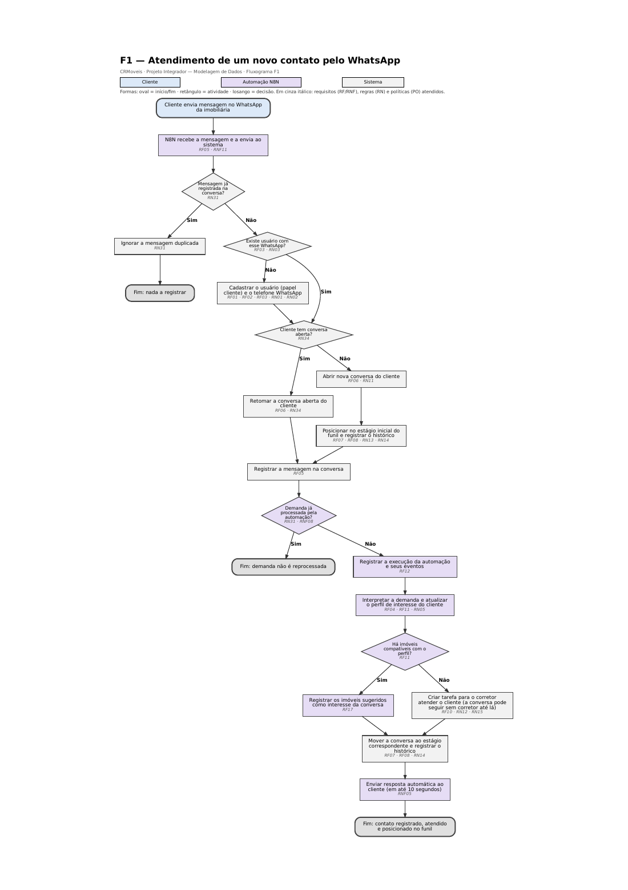

### F2 — Captação de imóvel

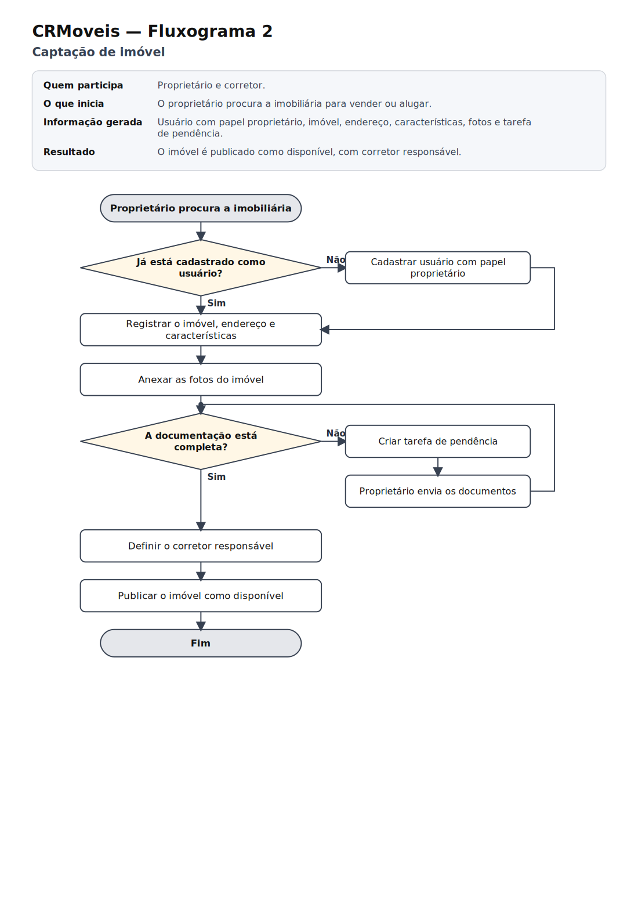

### F3 — Visita e proposta

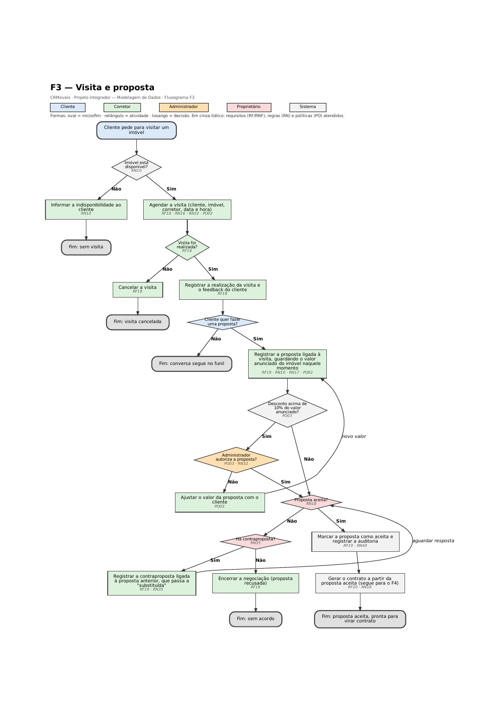

### F4 — Venda: contrato, financiamento e comissão


### F5 — Locação: ciclo mensal do aluguel

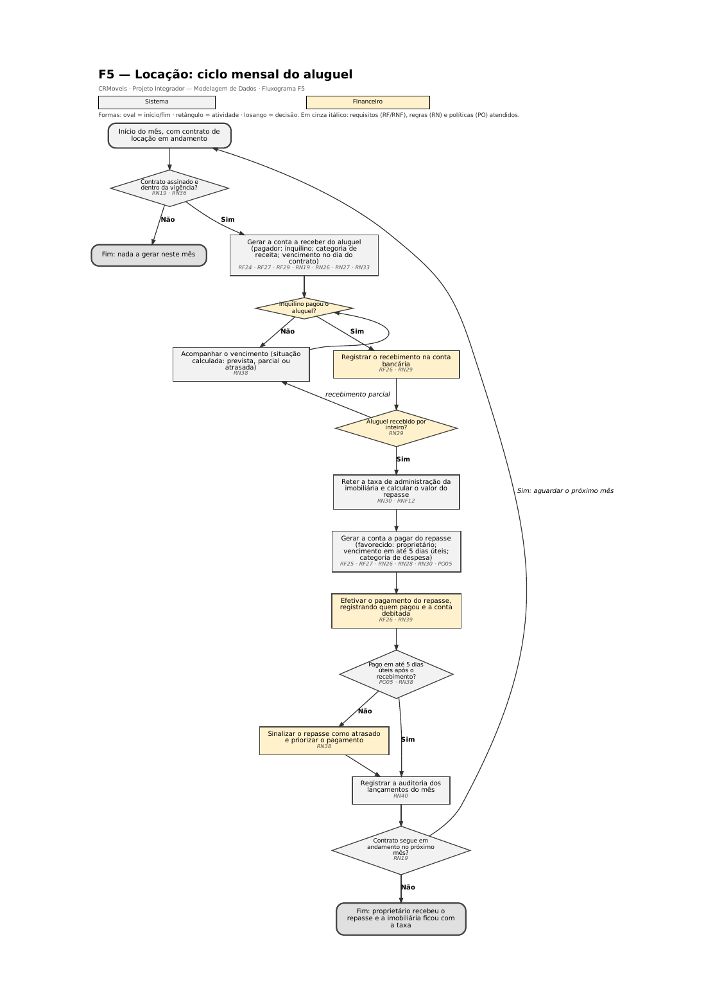

## 11. Entidades

O modelo tem **28 entidades**. Cada uma existe porque um requisito ou regra precisa dela.

| Entidade | Tipo | Por que existe | Requisito · regra | Folha do DER |
|---|---|---|---|---|
| **USUARIO** | forte | Toda pessoa ou instituição que circula no CRM: cliente, proprietário, inquilino, corretor, financeiro, fornecedor, administrador e banco. Uma entidade só evita cadastro duplicado. | RF01, RF02 · RN01, RN02, RN32, RN33 | 2 |
| **TELEFONE** | forte | A pessoa pode ter vários telefones, e é pelo número do WhatsApp que o sistema a identifica. Tem identificador próprio porque os telefones que não são de WhatsApp podem ser compartilhados. | RF03 · RN03 | 2 |
| **PERFIL_INTERESSE** | fraca | Guarda o que o cliente procura, para a automação sugerir imóveis. Só existe ligado a um usuário. | RF04, RF11 · RN05 | 2 |
| **IMOVEL** | forte | O produto da imobiliária, com endereço, características, valor e situação. | RF13, RF14 · RN06, RN10 | 2 |
| **FOTO** | fraca | Galeria do imóvel; a foto não tem sentido fora dele. | RF15 · RN09 | 2 |
| **CARACTERISTICA** | forte | Catálogo de itens (piscina, elevador, aceita pet) que permite filtrar imóveis sem depender de texto livre. | RF13 · RN08 | 2 |
| **CONVERSA_IMOVEL** | associativa | Registra quais imóveis interessam em cada conversa e desde quando. | RF17 | 2 |
| **CONVERSA** | forte | O atendimento de um cliente, que concentra as mensagens e a posição no funil. | RF05, RF06 · RN11, RN12, RN34 | 3 |
| **MENSAGEM** | fraca | Cada mensagem trocada ou nota interna; só existe dentro de uma conversa. Guarda o código externo da mensagem do WhatsApp, que impede o registro em duplicidade. | RF05 · RN31 | 3 |
| **FUNIL_ESTAGIO** | forte | As etapas do funil de vendas (novo contato, visita, proposta, fechado). | RF07 · RN13 | 3 |
| **HISTORICO_ESTAGIO** | associativa | Cada passagem de uma conversa por um estágio, com data e hora; base do relatório de conversão. | RF08, RF30 · RN14 | 3 |
| **TAREFA** | forte | Pendências do corretor, com prazo, ligadas ou não a uma conversa. | RF10 · RN15 | 3 |
| **TAG** | forte | Etiquetas livres para classificar conversas. | RF09 | 3 |
| **VISITA** | associativa | O fato de um cliente visitar um imóvel com um corretor, com data, situação e feedback. | RF18 · RN16 | 4 |
| **PROPOSTA** | associativa | A oferta de um cliente por um imóvel, com valor, valor anunciado, condições, situação e a autorização quando há desconto alto. | RF19 · RN17, RN35 · PO03 | 4 |
| **CONTRATO** | forte | O negócio fechado, de venda ou de locação, com os percentuais que definem a corretagem e o repasse. Dispara toda a parte financeira. | RF20, RF33 · RN18, RN19, RN30, RN36, RN37 · PO04 | 4 |
| **DOCUMENTO** | fraca | Arquivos do contrato (escritura, vistoria, documentos pessoais). | RF21 | 4 |
| **COMISSAO** | associativa | A parte de cada corretor em um contrato, com percentual, regra de pagamento e data de aprovação. | RF22, RF28 · RN20, RN21, RN24 · PO01 | 4 |
| **FINANCIAMENTO** | fraca | Os dados do crédito bancário de um contrato, principalmente a data de liberação, que define quando a corretagem cai. | RF23 · RN22, RN23 | 5 |
| **CONTA_RECEBER** | forte | Tudo o que a imobiliária tem a receber, com quem paga e o vencimento. | RF24 · RN26, RN27 | 5 |
| **RECEBIMENTO** | fraca | Cada baixa de uma conta a receber; permite recebimento parcial. | RF26 · RN29 | 5 |
| **CATEGORIA_FINANCEIRA** | forte | Classifica receitas e despesas para os relatórios financeiros. | RF29, RF31 · RN26 | 5 |
| **CONTA_BANCARIA** | forte | Onde o dinheiro entra e sai: contas e caixa da imobiliária. | RF26 · RN29 | 5 |
| **CONTA_PAGAR** | forte | Tudo o que a imobiliária tem a pagar: comissões, repasses, despesas e impostos, com quem paga e quem recebe. | RF25, RF27 · RN25, RN28 | 6 |
| **PAGAMENTO** | fraca | Cada baixa de uma conta a pagar; permite pagamento parcial. | RF26 · RN29 | 6 |
| **AUTOMACAO_EXECUCAO** | fraca | Cada vez que o N8N processa uma demanda de uma conversa; garante que a mesma demanda não seja processada duas vezes. | RF11 · RN31 | 6 |
| **AUTOMACAO_LOG** | fraca | Eventos técnicos de cada execução, para rastrear falhas da integração. | RF12 | 6 |
| **AUDITORIA** | forte | Registro de quem criou, alterou ou cancelou contratos, propostas, comissões e lançamentos financeiros, e quando. | RF34 · RN40 · RNF04 | 6 |

**Tipos:** *forte* tem identificação própria; *fraca* depende da identificação de outra entidade e usa um identificador parcial; *associativa* nasce de um relacionamento N:N e guarda informações da própria relação.

## 12. Atributos

A lista completa, com classe, obrigatoriedade, descrição e regra de cada atributo, está no [dicionário de dados](#15-dicionário-de-dados-conceitual). Aqui ficam as classificações.

| Classificação | Atributos |
|---|---|
| **Identificador** | USUARIO.id_usuario, TELEFONE.id_telefone, IMOVEL.id_imovel, CARACTERISTICA.id_caracteristica, CONVERSA.id_conversa, FUNIL_ESTAGIO.id_estagio, TAREFA.id_tarefa, TAG.id_tag, VISITA.id_visita, PROPOSTA.id_proposta, CONTRATO.id_contrato, CATEGORIA_FINANCEIRA.id_categoria, CONTA_BANCARIA.id_conta, CONTA_RECEBER.id_conta_receber, CONTA_PAGAR.id_conta_pagar, AUDITORIA.id_auditoria |
| **Identificador parcial (entidade fraca)** | PERFIL_INTERESSE.nr_perfil, FOTO.nr_foto, MENSAGEM.nr_mensagem, HISTORICO_ESTAGIO.dt_alteracao, DOCUMENTO.nr_documento, RECEBIMENTO.nr_recebimento, PAGAMENTO.nr_pagamento, AUTOMACAO_EXECUCAO.nr_execucao, AUTOMACAO_LOG.nr_log. FINANCIAMENTO é identificado apenas pelo contrato (relação 1:1) |
| **Composto** | IMOVEL.endereco (nm_logradouro, nr_endereco, ds_complemento, nm_bairro, nm_cidade, sg_uf, nr_cep) |
| **Multivalorado** | USUARIO.tp_papel (cliente, proprietário, inquilino, corretor, financeiro, fornecedor, administrador, instituição financeira) |
| **Derivado** | COMISSAO.vl_comissao (pc_comissao × CONTRATO.vl_corretagem); CONTRATO.vl_corretagem (vl_final × pc_corretagem); CONTA_RECEBER.st_conta e CONTA_PAGAR.st_conta (calculados a partir das baixas e do vencimento); CONVERSA.dt_atualizacao (data da última mensagem) |
| **Simples** | Todos os demais. A obrigatoriedade de cada atributo (sim, não ou condicional) está na coluna *Obrig.* do dicionário |

### Atributos de relacionamento

Informações que descrevem a relação, e não uma das entidades (Etapa 15 do manual).

| Relacionamento | Atributos | Por que pertencem à relação |
|---|---|---|
| CONVERSA_IMOVEL | dt_interesse | A data de interesse descreve o vínculo entre aquela conversa e aquele imóvel |
| HISTORICO_ESTAGIO | dt_alteracao | A data e hora descrevem a passagem da conversa por um estágio |
| VISITA | id_visita, dt_visita, st_visita, ds_feedback | Data, situação e feedback descrevem o encontro entre cliente e imóvel |
| PROPOSTA | id_proposta, vl_proposto, vl_anunciado, ds_condicoes, st_proposta, dt_proposta, dt_autorizacao | Valor, condições e situação descrevem a oferta daquele cliente por aquele imóvel |
| COMISSAO | pc_comissao, vl_comissao, tp_regra_pagamento, st_comissao, dt_aprovacao | Percentual e regra de pagamento descrevem a participação do corretor naquele contrato |
| AUTORIZA (USUARIO–PROPOSTA) | dt_autorizacao | Descreve a autorização do administrador. Como o relacionamento é 1:N, o atributo fica representado junto da PROPOSTA |
| APROVA (USUARIO–COMISSAO) | dt_aprovacao | Descreve a aprovação do administrador. Como o relacionamento é 1:N, o atributo fica representado junto da COMISSAO |

## 13. Relacionamentos

São **46 relacionamentos**, contando os que foram representados por entidade associativa.

| Relacionamento | Entre | Significado | Requisito · regra |
|---|---|---|---|
| **POSSUI** | USUARIO — TELEFONE | Um usuário possui telefones | RN03 |
| **BUSCA** | USUARIO — PERFIL_INTERESSE | Um usuário busca imóveis com determinado perfil | RN05 |
| **ANUNCIA** | USUARIO (proprietário) — IMOVEL | O proprietário anuncia o imóvel | RN06 |
| **RESPONSAVEL** | USUARIO (corretor) — IMOVEL | O corretor é responsável pelo imóvel | RN07 |
| **TEM** | IMOVEL — FOTO | O imóvel tem fotos | RN09 |
| **APRESENTA** | IMOVEL — CARACTERISTICA | O imóvel possui características | RN08 |
| **INTERESSA (associativa CONVERSA_IMOVEL)** | IMOVEL — CONVERSA | A conversa se interessa por imóveis | RF17 |
| **INICIA** | USUARIO (cliente) — CONVERSA | O cliente inicia a conversa | RN11 |
| **ATENDE** | USUARIO (corretor) — CONVERSA | O corretor atende a conversa | RN12 |
| **CONTEM** | CONVERSA — MENSAGEM | A conversa contém mensagens | RF05 |
| **MARCA** | CONVERSA — TAG | A conversa é marcada com tags | RF09 |
| **GERA TAREFA** | CONVERSA — TAREFA | A conversa gera tarefas | RN15 |
| **EXECUTA** | USUARIO (corretor) — TAREFA | O corretor executa a tarefa | RN15 |
| **PERTENCE A** | CONVERSA — FUNIL_ESTAGIO | A conversa está em um estágio do funil | RN13 |
| **REGISTRA** | HISTORICO_ESTAGIO — USUARIO (responsável) | O usuário registra a mudança de estágio | RF08 |
| **MOVE (associativa HISTORICO_ESTAGIO)** | CONVERSA — FUNIL_ESTAGIO | A conversa passa pelos estágios do funil | RN14 |
| **ACOMPANHA** | VISITA — USUARIO (corretor) | O corretor acompanha a visita | RN16 |
| **ORIGINA** | VISITA — PROPOSTA | A visita dá origem à proposta | RN17 |
| **RESPONDE** | PROPOSTA — PROPOSTA (recursivo) | A contraproposta responde à proposta anterior | RN35 |
| **NEGOCIA** | PROPOSTA — USUARIO (corretor) | O corretor negocia a proposta | RF19 |
| **FECHA** | PROPOSTA — CONTRATO | A proposta aceita fecha o contrato | RN18 |
| **ANEXA** | CONTRATO — DOCUMENTO | O contrato tem documentos anexados | RF21 |
| **AUTORIZA** | PROPOSTA — USUARIO (administrador) | O administrador autoriza a proposta com desconto acima do limite | PO03 |
| **APROVA** | COMISSAO — USUARIO (administrador) | O administrador aprova a comissão antes do pagamento | PO01 |
| **VISITA (associativa VISITA)** | USUARIO (cliente) — IMOVEL | O cliente visita o imóvel | RN16 |
| **PROPOE (associativa PROPOSTA)** | USUARIO (cliente) — IMOVEL | O cliente faz proposta pelo imóvel | RF19 |
| **RECEBE (associativa COMISSAO)** | CONTRATO — USUARIO (corretor) | O corretor recebe comissão do contrato | RN20 |
| **FINANCIA** | CONTRATO — FINANCIAMENTO | O contrato é financiado | RN22 |
| **CONCEDE** | USUARIO (instituição financeira) — FINANCIAMENTO | O banco concede o financiamento | RN27, RN33 |
| **GERA RECEITA** | CONTRATO — CONTA_RECEBER | O contrato gera contas a receber | RF24 |
| **LIBERA** | FINANCIAMENTO — CONTA_RECEBER | A liberação do crédito gera a conta a receber da corretagem | RN23 |
| **CLASSIFICA** | CATEGORIA_FINANCEIRA — CONTA_RECEBER | A categoria classifica a conta a receber | RN26 |
| **PAGA** | USUARIO (pagador) — CONTA_RECEBER | A pessoa paga a conta a receber | RN27 |
| **QUITA** | CONTA_RECEBER — RECEBIMENTO | A conta a receber é baixada por recebimentos | RN29 |
| **CREDITA** | CONTA_BANCARIA — RECEBIMENTO | O recebimento entra em uma conta bancária | RN29 |
| **GERA DESPESA** | CONTRATO — CONTA_PAGAR | O contrato origina contas a pagar | RF25 |
| **CATEGORIZA** | CATEGORIA_FINANCEIRA — CONTA_PAGAR | A categoria classifica a conta a pagar | RN26 |
| **FAVORECE** | USUARIO (favorecido) — CONTA_PAGAR | A conta a pagar favorece uma pessoa | RF25 |
| **CUSTEIA** | USUARIO (pagador) — CONTA_PAGAR | A pessoa paga a conta a pagar | RN28 |
| **LANCA** | COMISSAO — CONTA_PAGAR | A comissão liberada lança a conta a pagar ao corretor | RN25 |
| **LIQUIDA** | CONTA_PAGAR — PAGAMENTO | A conta a pagar é baixada por pagamentos | RN29 |
| **DEBITA** | CONTA_BANCARIA — PAGAMENTO | O pagamento sai de uma conta bancária | RN29 |
| **EFETIVA** | USUARIO (financeiro ou administrador) — PAGAMENTO | O usuário efetiva o pagamento | RN39, PO01 |
| **DISPARA** | CONVERSA — AUTOMACAO_EXECUCAO | A conversa dispara execuções da automação | RN31 |
| **GRAVA** | AUTOMACAO_EXECUCAO — AUTOMACAO_LOG | A execução registra eventos (logs) | RF12 |
| **PRATICA** | USUARIO — AUDITORIA | O usuário pratica a ação registrada na auditoria | RN40 |

## 14. Cardinalidades

Cada cardinalidade foi definida pelo método **vá e volte** do manual: partindo de uma ocorrência de cada lado e perguntando quantas ocorrências do outro lado ela pode ter.

**Leitura no DER (convenção do manual):** o par (mín,máx) escrito junto de uma entidade indica quantas vezes cada ocorrência *dessa* entidade participa do relacionamento, isto é, com quantas ocorrências da outra entidade ela se relaciona. Exemplo: em `USUARIO (0,n) — POSSUI — (1,1) TELEFONE`, um usuário possui nenhum ou vários telefones (0,n), e cada telefone pertence a exatamente um usuário (1,1). A coluna *Ida* corresponde ao par da primeira entidade, e a coluna *Volta*, ao par da segunda.

| Relacionamento | Ida | Volta | Como fica no DER | Regra |
|---|---|---|---|---|
| POSSUI | 1 USUARIO → nenhum ou vários TELEFONE | 1 TELEFONE → exatamente um USUARIO | USUARIO (0,n) — POSSUI — (1,1) TELEFONE | RN03 |
| BUSCA | 1 USUARIO → nenhum ou vários PERFIL_INTERESSE | 1 PERFIL_INTERESSE → exatamente um USUARIO | USUARIO (0,n) — BUSCA — (1,1) PERFIL_INTERESSE | RN05 |
| ANUNCIA | 1 USUARIO (proprietário) → nenhum ou vários IMOVEL | 1 IMOVEL → exatamente um USUARIO (proprietário) | USUARIO (proprietário) (0,n) — ANUNCIA — (1,1) IMOVEL | RN06 |
| RESPONSAVEL | 1 USUARIO (corretor) → nenhum ou vários IMOVEL | 1 IMOVEL → nenhum ou um USUARIO (corretor) | USUARIO (corretor) (0,n) — RESPONSAVEL — (0,1) IMOVEL | RN07 |
| TEM | 1 IMOVEL → nenhum ou vários FOTO | 1 FOTO → exatamente um IMOVEL | IMOVEL (0,n) — TEM — (1,1) FOTO | RN09 |
| APRESENTA | 1 IMOVEL → nenhum ou vários CARACTERISTICA | 1 CARACTERISTICA → nenhum ou vários IMOVEL | IMOVEL (0,n) — APRESENTA — (0,n) CARACTERISTICA | RN08 |
| INTERESSA | 1 IMOVEL → nenhum ou vários CONVERSA | 1 CONVERSA → nenhum ou vários IMOVEL | IMOVEL (0,n) — INTERESSA — (0,n) CONVERSA · N:N | RF17 |
| INICIA | 1 USUARIO (cliente) → nenhum ou vários CONVERSA | 1 CONVERSA → exatamente um USUARIO (cliente) | USUARIO (cliente) (0,n) — INICIA — (1,1) CONVERSA | RN11 |
| ATENDE | 1 USUARIO (corretor) → nenhum ou vários CONVERSA | 1 CONVERSA → nenhum ou um USUARIO (corretor) | USUARIO (corretor) (0,n) — ATENDE — (0,1) CONVERSA | RN12 |
| CONTEM | 1 CONVERSA → nenhum ou vários MENSAGEM | 1 MENSAGEM → exatamente um CONVERSA | CONVERSA (0,n) — CONTEM — (1,1) MENSAGEM | RF05 |
| MARCA | 1 CONVERSA → nenhum ou vários TAG | 1 TAG → nenhum ou vários CONVERSA | CONVERSA (0,n) — MARCA — (0,n) TAG | RF09 |
| GERA TAREFA | 1 CONVERSA → nenhum ou vários TAREFA | 1 TAREFA → nenhum ou um CONVERSA | CONVERSA (0,n) — GERA TAREFA — (0,1) TAREFA | RN15 |
| EXECUTA | 1 USUARIO (corretor) → nenhum ou vários TAREFA | 1 TAREFA → exatamente um USUARIO (corretor) | USUARIO (corretor) (0,n) — EXECUTA — (1,1) TAREFA | RN15 |
| PERTENCE A | 1 CONVERSA → exatamente um FUNIL_ESTAGIO | 1 FUNIL_ESTAGIO → nenhum ou vários CONVERSA | CONVERSA (1,1) — PERTENCE A — (0,n) FUNIL_ESTAGIO | RN13 |
| REGISTRA | 1 HISTORICO_ESTAGIO → nenhum ou um USUARIO (responsável) | 1 USUARIO (responsável) → nenhum ou vários HISTORICO_ESTAGIO | HISTORICO_ESTAGIO (0,1) — REGISTRA — (0,n) USUARIO (responsável) | RF08 |
| MOVE | 1 CONVERSA → nenhum ou vários FUNIL_ESTAGIO | 1 FUNIL_ESTAGIO → nenhum ou vários CONVERSA | CONVERSA (0,n) — MOVE — (0,n) FUNIL_ESTAGIO · N:N | RN14 |
| ACOMPANHA | 1 VISITA → exatamente um USUARIO (corretor) | 1 USUARIO (corretor) → nenhum ou vários VISITA | VISITA (1,1) — ACOMPANHA — (0,n) USUARIO (corretor) | RN16 |
| ORIGINA | 1 VISITA → nenhum ou vários PROPOSTA | 1 PROPOSTA → nenhum ou um VISITA | VISITA (0,n) — ORIGINA — (0,1) PROPOSTA | RN17 |
| RESPONDE | 1 PROPOSTA (anterior) → nenhuma ou uma PROPOSTA (contraproposta) | 1 PROPOSTA (contraproposta) → nenhuma ou uma PROPOSTA (anterior) | PROPOSTA (anterior) (0,1) — RESPONDE — (0,1) PROPOSTA (contraproposta) · recursivo | RN35 |
| NEGOCIA | 1 PROPOSTA → exatamente um USUARIO (corretor) | 1 USUARIO (corretor) → nenhum ou vários PROPOSTA | PROPOSTA (1,1) — NEGOCIA — (0,n) USUARIO (corretor) | RF19 |
| FECHA | 1 PROPOSTA → nenhum ou um CONTRATO | 1 CONTRATO → exatamente um PROPOSTA | PROPOSTA (0,1) — FECHA — (1,1) CONTRATO | RN18 |
| ANEXA | 1 CONTRATO → nenhum ou vários DOCUMENTO | 1 DOCUMENTO → exatamente um CONTRATO | CONTRATO (0,n) — ANEXA — (1,1) DOCUMENTO | RF21 |
| AUTORIZA | 1 PROPOSTA → nenhum ou um USUARIO (administrador) | 1 USUARIO (administrador) → nenhum ou vários PROPOSTA | PROPOSTA (0,1) — AUTORIZA — (0,n) USUARIO (administrador) | PO03 |
| APROVA | 1 COMISSAO → nenhum ou um USUARIO (administrador) | 1 USUARIO (administrador) → nenhum ou vários COMISSAO | COMISSAO (0,1) — APROVA — (0,n) USUARIO (administrador) | PO01 |
| VISITA | 1 USUARIO (cliente) → nenhum ou vários IMOVEL | 1 IMOVEL → nenhum ou vários USUARIO (cliente) | USUARIO (cliente) (0,n) — VISITA — (0,n) IMOVEL · N:N | RN16 |
| PROPOE | 1 USUARIO (cliente) → nenhum ou vários IMOVEL | 1 IMOVEL → nenhum ou vários USUARIO (cliente) | USUARIO (cliente) (0,n) — PROPOE — (0,n) IMOVEL · N:N | RF19 |
| RECEBE | 1 CONTRATO → nenhum ou vários USUARIO (corretor) | 1 USUARIO (corretor) → nenhum ou vários CONTRATO | CONTRATO (0,n) — RECEBE — (0,n) USUARIO (corretor) · N:N | RN20 |
| FINANCIA | 1 CONTRATO → nenhum ou um FINANCIAMENTO | 1 FINANCIAMENTO → exatamente um CONTRATO | CONTRATO (0,1) — FINANCIA — (1,1) FINANCIAMENTO | RN22 |
| CONCEDE | 1 USUARIO (instituição financeira) → nenhum ou vários FINANCIAMENTO | 1 FINANCIAMENTO → exatamente um USUARIO (instituição financeira) | USUARIO (instituição financeira) (0,n) — CONCEDE — (1,1) FINANCIAMENTO | RN27, RN33 |
| GERA RECEITA | 1 CONTRATO → nenhum ou vários CONTA_RECEBER | 1 CONTA_RECEBER → nenhum ou um CONTRATO | CONTRATO (0,n) — GERA RECEITA — (0,1) CONTA_RECEBER | RF24 |
| LIBERA | 1 FINANCIAMENTO → nenhum ou vários CONTA_RECEBER | 1 CONTA_RECEBER → nenhum ou um FINANCIAMENTO | FINANCIAMENTO (0,n) — LIBERA — (0,1) CONTA_RECEBER | RN23 |
| CLASSIFICA | 1 CATEGORIA_FINANCEIRA → nenhum ou vários CONTA_RECEBER | 1 CONTA_RECEBER → exatamente um CATEGORIA_FINANCEIRA | CATEGORIA_FINANCEIRA (0,n) — CLASSIFICA — (1,1) CONTA_RECEBER | RN26 |
| PAGA | 1 USUARIO (pagador) → nenhum ou vários CONTA_RECEBER | 1 CONTA_RECEBER → exatamente um USUARIO (pagador) | USUARIO (pagador) (0,n) — PAGA — (1,1) CONTA_RECEBER | RN27 |
| QUITA | 1 CONTA_RECEBER → nenhum ou vários RECEBIMENTO | 1 RECEBIMENTO → exatamente um CONTA_RECEBER | CONTA_RECEBER (0,n) — QUITA — (1,1) RECEBIMENTO | RN29 |
| CREDITA | 1 CONTA_BANCARIA → nenhum ou vários RECEBIMENTO | 1 RECEBIMENTO → exatamente um CONTA_BANCARIA | CONTA_BANCARIA (0,n) — CREDITA — (1,1) RECEBIMENTO | RN29 |
| GERA DESPESA | 1 CONTRATO → nenhum ou vários CONTA_PAGAR | 1 CONTA_PAGAR → nenhum ou um CONTRATO | CONTRATO (0,n) — GERA DESPESA — (0,1) CONTA_PAGAR | RF25 |
| CATEGORIZA | 1 CATEGORIA_FINANCEIRA → nenhum ou vários CONTA_PAGAR | 1 CONTA_PAGAR → exatamente um CATEGORIA_FINANCEIRA | CATEGORIA_FINANCEIRA (0,n) — CATEGORIZA — (1,1) CONTA_PAGAR | RN26 |
| FAVORECE | 1 USUARIO (favorecido) → nenhum ou vários CONTA_PAGAR | 1 CONTA_PAGAR → nenhum ou um USUARIO (favorecido) | USUARIO (favorecido) (0,n) — FAVORECE — (0,1) CONTA_PAGAR | RF25 |
| CUSTEIA | 1 USUARIO (pagador) → nenhum ou vários CONTA_PAGAR | 1 CONTA_PAGAR → nenhum ou um USUARIO (pagador) | USUARIO (pagador) (0,n) — CUSTEIA — (0,1) CONTA_PAGAR | RN28 |
| LANCA | 1 COMISSAO → nenhum ou um CONTA_PAGAR | 1 CONTA_PAGAR → nenhum ou um COMISSAO | COMISSAO (0,1) — LANCA — (0,1) CONTA_PAGAR | RN25 |
| LIQUIDA | 1 CONTA_PAGAR → nenhum ou vários PAGAMENTO | 1 PAGAMENTO → exatamente um CONTA_PAGAR | CONTA_PAGAR (0,n) — LIQUIDA — (1,1) PAGAMENTO | RN29 |
| DEBITA | 1 CONTA_BANCARIA → nenhum ou vários PAGAMENTO | 1 PAGAMENTO → exatamente um CONTA_BANCARIA | CONTA_BANCARIA (0,n) — DEBITA — (1,1) PAGAMENTO | RN29 |
| EFETIVA | 1 USUARIO → nenhum ou vários PAGAMENTO | 1 PAGAMENTO → exatamente um USUARIO | USUARIO (0,n) — EFETIVA — (1,1) PAGAMENTO | RN39 |
| DISPARA | 1 CONVERSA → nenhum ou vários AUTOMACAO_EXECUCAO | 1 AUTOMACAO_EXECUCAO → exatamente um CONVERSA | CONVERSA (0,n) — DISPARA — (1,1) AUTOMACAO_EXECUCAO | RN31 |
| GRAVA | 1 AUTOMACAO_EXECUCAO → nenhum ou vários AUTOMACAO_LOG | 1 AUTOMACAO_LOG → exatamente um AUTOMACAO_EXECUCAO | AUTOMACAO_EXECUCAO (0,n) — GRAVA — (1,1) AUTOMACAO_LOG | RF12 |
| PRATICA | 1 USUARIO → nenhuma ou várias AUDITORIA | 1 AUDITORIA → exatamente um USUARIO | USUARIO (0,n) — PRATICA — (1,1) AUDITORIA | RN40 |

**Relacionamentos N:N verificados (Etapa 14):** imóvel × característica e conversa × tag ficaram como losango, porque não têm informação própria; conversa × imóvel, conversa × estágio, cliente × imóvel (visita e proposta) e contrato × corretor viraram entidades associativas, porque têm. **Relacionamento recursivo:** RESPONDE liga uma proposta a outra proposta (a contraproposta) e é opcional e único nos dois lados (0,1).

## 15. Dicionário de dados conceitual

Preliminar, no formato do manual: identificar, descrever e organizar. Tipos de dados e implementação física ficam para o modelo lógico.

**Padrão de nomes.** Entidades e relacionamentos são escritos em maiúsculas, sem acento. Os atributos usam prefixo pelo tipo de informação:

| Prefixo | Uso | Exemplo |
|---|---|---|
| `id_` | Identificador único da entidade | id_usuario |
| `nr_` | Número (sequencial, parcial ou de documento) | nr_perfil, nr_cpf_cnpj |
| `cd_` | Código vindo de sistema externo | cd_imobizi |
| `nm_` | Nome | nm_usuario |
| `ds_` | Descrição ou texto livre | ds_email |
| `tp_` | Tipo ou categoria com lista de valores | tp_papel |
| `st_` | Situação (estado) | st_visita |
| `fl_` | Indicador sim/não | fl_ativo |
| `dt_` | Data ou data e hora | dt_cadastro |
| `vl_` | Valor numérico (monetário ou medida) | vl_venda |
| `pc_` | Percentual | pc_comissao |
| `qt_` | Quantidade | qt_quartos |
| `sg_` | Sigla | sg_uf |

**Colunas.** *Classe* segue a seção 12 (Identificador, Ident. parcial, Simples, Composto, Multivalorado ou Derivado). *Obrig.* indica se o dado é obrigatório (Sim), opcional (Não) ou obrigatório apenas em certas situações descritas na regra (Cond.).

### USUARIO · forte

*USUARIO é qualquer pessoa ou instituição cadastrada no CRM, tenha ou não acesso ao sistema (justificativa 17.1).*

| Atributo | Classe | Obrig. | Descrição | Regra / observação |
|---|---|---|---|---|
| id_usuario | Identificador | Sim | Identificador do usuário | Identificação única |
| nm_usuario | Simples | Sim | Nome completo ou razão social | — |
| nr_cpf_cnpj | Simples | Cond. | CPF ou CNPJ | Não pode se repetir; obrigatório para proprietário, instituição financeira e quem assina contrato (RN04); apagado na anonimização (PO07) |
| ds_email | Simples | Cond. | E-mail de contato e de acesso | Não pode se repetir; obrigatório para quem acessa o sistema |
| ds_senha_hash | Simples | Cond. | Senha de acesso, guardada como hash | Só para quem acessa o sistema; nunca em texto (RNF02) |
| nr_creci | Simples | Cond. | Registro do corretor no CRECI | Obrigatório para quem tem o papel corretor |
| tp_origem | Simples | Não | Canal pelo qual a pessoa chegou | Site, indicação, portal, Instagram, WhatsApp ou interno |
| tp_papel | Multivalorado | Sim | Papéis que a pessoa exerce | Cliente, proprietário, inquilino, corretor, financeiro, fornecedor, administrador ou instituição financeira; pelo menos um (RN01, RN02); inquilino e instituição financeira conforme RN33 |
| fl_ativo | Simples | Sim | Indica se o cadastro está ativo | Cadastro inativo não acessa o sistema |
| dt_cadastro | Simples | Sim | Data do cadastro | Preenchida automaticamente |
| dt_anonimizacao | Simples | Não | Data em que os dados pessoais foram anonimizados | Preenchida quando o titular pede a exclusão e há obrigação de guarda (PO07) |

### TELEFONE · forte

| Atributo | Classe | Obrig. | Descrição | Regra / observação |
|---|---|---|---|---|
| id_telefone | Identificador | Sim | Identificador do telefone | Identificação única |
| nr_telefone | Simples | Sim | Número com DDD | Quando o tipo é WhatsApp, não pode se repetir no sistema (RN03) |
| tp_telefone | Simples | Sim | Tipo da linha | Celular, WhatsApp ou fixo |
| fl_principal | Simples | Sim | Indica o telefone preferencial | Apenas um principal por usuário |

### PERFIL_INTERESSE · fraca

| Atributo | Classe | Obrig. | Descrição | Regra / observação |
|---|---|---|---|---|
| nr_perfil | Ident. parcial | Sim | Número do perfil dentro do usuário | Identificador parcial |
| tp_finalidade | Simples | Sim | Venda ou locação | Mesmo vocabulário de IMOVEL |
| tp_imovel | Simples | Não | Tipo de imóvel procurado | Ex.: apartamento, casa, comercial |
| nm_cidade | Simples | Não | Cidade desejada | — |
| nm_bairro | Simples | Não | Bairro desejado | Pode ficar em branco |
| vl_minimo | Simples | Não | Valor mínimo aceito | Não pode ser maior que o valor máximo |
| vl_maximo | Simples | Não | Valor máximo aceito | Maior ou igual ao mínimo |
| qt_quartos_min | Simples | Não | Quantidade mínima de quartos | — |

### IMOVEL · forte

| Atributo | Classe | Obrig. | Descrição | Regra / observação |
|---|---|---|---|---|
| id_imovel | Identificador | Sim | Identificador do imóvel | Identificação única |
| cd_imobizi | Simples | Cond. | Código do imóvel no IMOBIZI | Não pode se repetir; obrigatório nos imóveis importados (RF14) |
| tp_imovel | Simples | Sim | Tipo do imóvel | Apartamento, casa, terreno, comercial ou rural |
| tp_finalidade | Simples | Sim | Venda, locação ou ambas | Define quais valores são obrigatórios (17.24) |
| endereco | Composto | Sim | Endereço do imóvel | Composto por nm_logradouro, nr_endereco, ds_complemento, nm_bairro, nm_cidade, sg_uf e nr_cep |
| vl_area_util | Simples | Não | Área útil em m² | — |
| vl_area_total | Simples | Não | Área total em m² | Maior ou igual à área útil |
| qt_quartos | Simples | Não | Quantidade de quartos | — |
| qt_banheiros | Simples | Não | Quantidade de banheiros | — |
| qt_vagas_garagem | Simples | Não | Quantidade de vagas de garagem | — |
| vl_venda | Simples | Cond. | Preço de venda | Obrigatório quando a finalidade é venda ou ambas |
| vl_aluguel | Simples | Cond. | Aluguel mensal pedido | Obrigatório quando a finalidade é locação ou ambas |
| st_imovel | Simples | Sim | Situação do imóvel | Disponível, reservado, vendido, alugado ou inativo; vendido, alugado ou inativo não recebe visita nem proposta (RN10) |
| ds_anuncio | Simples | Não | Texto do anúncio | — |
| dt_cadastro | Simples | Sim | Data do cadastro | Preenchida automaticamente |

### FOTO · fraca

| Atributo | Classe | Obrig. | Descrição | Regra / observação |
|---|---|---|---|---|
| nr_foto | Ident. parcial | Sim | Número da foto dentro do imóvel | Identificador parcial; não muda quando a galeria é reordenada |
| nr_ordem | Simples | Sim | Posição da foto na galeria | Pode ser alterada |
| ds_url | Simples | Sim | Endereço do arquivo da foto | — |

### CARACTERISTICA · forte

| Atributo | Classe | Obrig. | Descrição | Regra / observação |
|---|---|---|---|---|
| id_caracteristica | Identificador | Sim | Identificador da característica | Identificação única |
| nm_caracteristica | Simples | Sim | Nome (piscina, elevador, aceita pet…) | Não pode se repetir |

### CONVERSA_IMOVEL · associativa

| Atributo | Classe | Obrig. | Descrição | Regra / observação |
|---|---|---|---|---|
| dt_interesse | Simples | Sim | Quando o imóvel passou a interessar na conversa | Atributo do relacionamento |

### CONVERSA · forte

| Atributo | Classe | Obrig. | Descrição | Regra / observação |
|---|---|---|---|---|
| id_conversa | Identificador | Sim | Identificador da conversa | Identificação única |
| st_conversa | Simples | Sim | Situação da conversa | Aberta ou encerrada (RN34) |
| ds_notas | Simples | Não | Anotações do corretor sobre o atendimento | — |
| dt_inicio | Simples | Sim | Data de abertura da conversa | Preenchida automaticamente |
| dt_atualizacao | Derivado | Sim | Data da última movimentação | Derivada da data da última mensagem |

### MENSAGEM · fraca

| Atributo | Classe | Obrig. | Descrição | Regra / observação |
|---|---|---|---|---|
| nr_mensagem | Ident. parcial | Sim | Número da mensagem dentro da conversa | Identificador parcial |
| cd_externo | Simples | Cond. | Código da mensagem no WhatsApp | Não se repete na mesma conversa, o que impede registrar a mesma mensagem duas vezes (RN31); vazio nas notas internas |
| tp_direcao | Simples | Cond. | Entrada (cliente) ou saída (imobiliária) | Em branco quando for nota interna |
| tp_canal | Simples | Sim | Meio da mensagem | WhatsApp, e-mail ou nota interna |
| ds_corpo | Simples | Sim | Conteúdo da mensagem | — |
| dt_mensagem | Simples | Sim | Data e hora da mensagem | — |

### FUNIL_ESTAGIO · forte

| Atributo | Classe | Obrig. | Descrição | Regra / observação |
|---|---|---|---|---|
| id_estagio | Identificador | Sim | Identificador do estágio | Identificação única |
| nm_estagio | Simples | Sim | Nome do estágio | Não pode se repetir |
| nr_ordem | Simples | Sim | Posição do estágio no funil | — |
| ds_cor | Simples | Não | Cor usada no quadro do funil | — |

### HISTORICO_ESTAGIO · associativa

| Atributo | Classe | Obrig. | Descrição | Regra / observação |
|---|---|---|---|---|
| dt_alteracao | Ident. parcial | Sim | Data e hora da mudança de estágio | Identificador parcial; toda mudança gera um registro e o mais recente é o estágio atual (RN14) |

### TAREFA · forte

| Atributo | Classe | Obrig. | Descrição | Regra / observação |
|---|---|---|---|---|
| id_tarefa | Identificador | Sim | Identificador da tarefa | Identificação única |
| ds_titulo | Simples | Sim | Resumo da tarefa | — |
| ds_tarefa | Simples | Não | Detalhes | — |
| dt_vencimento | Simples | Sim | Prazo da tarefa | A situação “atrasada” é calculada a partir do prazo e não é armazenada |
| st_tarefa | Simples | Sim | Situação | Pendente, concluída ou cancelada |

### TAG · forte

| Atributo | Classe | Obrig. | Descrição | Regra / observação |
|---|---|---|---|---|
| id_tag | Identificador | Sim | Identificador da tag | Identificação única |
| nm_tag | Simples | Sim | Texto da etiqueta | Não pode se repetir |

### VISITA · associativa

| Atributo | Classe | Obrig. | Descrição | Regra / observação |
|---|---|---|---|---|
| id_visita | Identificador | Sim | Identificador da visita | Identificação única |
| dt_visita | Simples | Sim | Data e hora da visita | O mesmo cliente não visita o mesmo imóvel duas vezes no mesmo horário (RN16) |
| st_visita | Simples | Sim | Situação | Agendada, realizada ou cancelada |
| ds_feedback | Simples | Cond. | Impressão do cliente após a visita | Preenchido quando a visita é realizada |

### PROPOSTA · associativa

| Atributo | Classe | Obrig. | Descrição | Regra / observação |
|---|---|---|---|---|
| id_proposta | Identificador | Sim | Identificador da proposta | Identificação única |
| vl_proposto | Simples | Sim | Valor oferecido | Desconto acima de 10% sobre o valor anunciado exige aprovação (PO03) |
| vl_anunciado | Simples | Sim | Valor anunciado do imóvel no momento da proposta | Base para calcular o desconto (PO03, 17.19) |
| ds_condicoes | Simples | Não | Forma de pagamento, prazos e financiamento | — |
| st_proposta | Simples | Sim | Situação | Pendente, aceita, recusada ou substituída (respondida por contraproposta, RN35) |
| dt_proposta | Simples | Sim | Data da proposta | — |
| dt_autorizacao | Simples | Cond. | Data da autorização do administrador | Obrigatória quando o desconto passa de 10% (PO03); atributo do relacionamento AUTORIZA |

### CONTRATO · forte

| Atributo | Classe | Obrig. | Descrição | Regra / observação |
|---|---|---|---|---|
| id_contrato | Identificador | Sim | Identificador do contrato | Identificação única |
| tp_contrato | Simples | Sim | Venda ou locação | RN19 |
| tp_forma_pagamento | Simples | Sim | Como o comprador paga | À vista, financiado ou parcelado direto; “financiado” se, e somente se, houver financiamento (RN22) |
| vl_final | Simples | Sim | Valor fechado; na locação, o aluguel mensal | — |
| pc_corretagem | Simples | Sim | Percentual de corretagem sobre o valor final | Na locação, incide sobre o aluguel mensal (taxa de intermediação); base da conta a receber da corretagem (RF24) |
| vl_corretagem | Derivado | Sim | Valor da corretagem | vl_final × pc_corretagem; base da comissão dos corretores (RN21) |
| pc_administracao | Simples | Cond. | Percentual retido do aluguel pela imobiliária | Obrigatório na locação; define o repasse ao proprietário (RN30) |
| nr_dia_vencimento | Simples | Cond. | Dia do mês em que vence o aluguel | Obrigatório na locação (RF27) |
| dt_assinatura | Simples | Cond. | Data da assinatura | Vazia enquanto o contrato é rascunho (RN36) |
| dt_inicio | Simples | Cond. | Início da vigência | Obrigatória na locação (RN19) |
| dt_fim | Simples | Cond. | Data de término | Obrigatória na locação (RN19) |
| st_contrato | Simples | Sim | Situação | Rascunho, vigente, encerrado ou cancelado; contrato assinado não é excluído, só cancelado (PO04) |
| dt_cancelamento | Simples | Cond. | Data do cancelamento | Obrigatória quando cancelado (PO04, RN37) |
| ds_motivo_cancelamento | Simples | Cond. | Motivo do cancelamento | Obrigatório quando cancelado (PO04, RN37) |

### DOCUMENTO · fraca

| Atributo | Classe | Obrig. | Descrição | Regra / observação |
|---|---|---|---|---|
| nr_documento | Ident. parcial | Sim | Número do documento dentro do contrato | Identificador parcial |
| nm_documento | Simples | Sim | Nome do documento | — |
| ds_url | Simples | Sim | Endereço do arquivo | — |

### COMISSAO · associativa

| Atributo | Classe | Obrig. | Descrição | Regra / observação |
|---|---|---|---|---|
| pc_comissao | Simples | Sim | Percentual do corretor sobre a corretagem do contrato | A soma no contrato não passa de 100% (RN20) |
| vl_comissao | Derivado | Sim | Valor da comissão | pc_comissao × vl_corretagem do contrato (RN21) |
| tp_regra_pagamento | Simples | Sim | Quando a comissão pode ser paga | Na assinatura, na liberação do crédito ou no recebimento (RN24) |
| st_comissao | Simples | Sim | Situação | Pendente, liberada ou cancelada; “paga” não é armazenada, pois deriva da conta a pagar ligada por LANCA (17.20) |
| dt_aprovacao | Simples | Cond. | Data da aprovação do administrador | Obrigatória antes do pagamento (PO01); atributo do relacionamento APROVA |

### FINANCIAMENTO · fraca

*Identificação: identificado pelo contrato (entidade fraca, relação 1:1). A instituição financeira é o usuário ligado pelo relacionamento CONCEDE.*

| Atributo | Classe | Obrig. | Descrição | Regra / observação |
|---|---|---|---|---|
| vl_financiado | Simples | Sim | Valor financiado | — |
| vl_entrada | Simples | Não | Valor de entrada | — |
| nr_parcelas | Simples | Não | Quantidade de parcelas | — |
| pc_juros_aa | Simples | Não | Taxa de juros ao ano | — |
| st_financiamento | Simples | Sim | Situação | Em análise, aprovado, reprovado, liberado ou cancelado |
| dt_aprovacao | Simples | Não | Data da aprovação do crédito | — |
| dt_liberacao | Simples | Cond. | Data em que o banco libera o crédito | Condiciona o recebimento da corretagem (RN23) |

### CONTA_RECEBER · forte

| Atributo | Classe | Obrig. | Descrição | Regra / observação |
|---|---|---|---|---|
| id_conta_receber | Identificador | Sim | Identificador da conta a receber | Identificação única |
| tp_papel_pagador | Simples | Sim | Papel exercido por quem paga | Cliente, inquilino, proprietário ou banco (RN27) |
| tp_origem_receita | Simples | Sim | Natureza da receita | Corretagem, intermediação, administração, aluguel ou serviço |
| ds_conta | Simples | Não | Descrição | — |
| dt_competencia | Simples | Cond. | Mês de referência | Obrigatório na locação |
| vl_receber | Simples | Sim | Valor a receber | — |
| dt_vencimento | Simples | Sim | Data de vencimento | — |
| st_conta | Derivado | Sim | Situação | Prevista, parcial, recebida ou atrasada, calculada a partir do valor, das baixas e do vencimento (RN38) |
| fl_cancelada | Simples | Sim | Indica conta cancelada | Único estado armazenado (RN37, RN38) |

### RECEBIMENTO · fraca

| Atributo | Classe | Obrig. | Descrição | Regra / observação |
|---|---|---|---|---|
| nr_recebimento | Ident. parcial | Sim | Número do recebimento dentro da conta | Identificador parcial |
| dt_recebimento | Simples | Sim | Data do recebimento | — |
| vl_recebido | Simples | Sim | Valor recebido | A soma não passa do valor da conta (RN29) |
| tp_forma_pagamento | Simples | Sim | Forma de pagamento | Pix, TED, boleto, dinheiro ou cartão |

### CATEGORIA_FINANCEIRA · forte

| Atributo | Classe | Obrig. | Descrição | Regra / observação |
|---|---|---|---|---|
| id_categoria | Identificador | Sim | Identificador da categoria | Identificação única |
| nm_categoria | Simples | Sim | Nome da categoria | Não pode se repetir |
| tp_categoria | Simples | Sim | Receita ou despesa | Deve ser compatível com a conta classificada (RN26) |

### CONTA_BANCARIA · forte

| Atributo | Classe | Obrig. | Descrição | Regra / observação |
|---|---|---|---|---|
| id_conta | Identificador | Sim | Identificador da conta | Identificação única |
| nm_apelido | Simples | Sim | Nome de referência da conta | Não pode se repetir |
| nm_instituicao | Simples | Não | Banco | — |
| tp_conta_bancaria | Simples | Sim | Tipo | Corrente, poupança ou caixa |
| fl_ativa | Simples | Sim | Indica se a conta está em uso | — |

### CONTA_PAGAR · forte

| Atributo | Classe | Obrig. | Descrição | Regra / observação |
|---|---|---|---|---|
| id_conta_pagar | Identificador | Sim | Identificador da conta a pagar | Identificação única |
| tp_papel_custeio | Simples | Sim | Papel de quem arca com o custo final | Imobiliária, proprietário ou inquilino (RN28) |
| tp_despesa | Simples | Sim | Natureza da despesa | Comissão, repasse ao proprietário, despesa ou imposto |
| ds_conta | Simples | Não | Descrição | — |
| dt_competencia | Simples | Cond. | Mês de referência | Obrigatório no repasse de aluguel |
| vl_pagar | Simples | Sim | Valor a pagar | — |
| dt_vencimento | Simples | Sim | Data de vencimento | No repasse, até 5 dias úteis após o recebimento do aluguel (PO05) |
| st_conta | Derivado | Sim | Situação | Prevista, parcial, paga ou atrasada, calculada a partir do valor, das baixas e do vencimento (RN38) |
| fl_cancelada | Simples | Sim | Indica conta cancelada | Único estado armazenado (RN37, RN38) |

### PAGAMENTO · fraca

| Atributo | Classe | Obrig. | Descrição | Regra / observação |
|---|---|---|---|---|
| nr_pagamento | Ident. parcial | Sim | Número do pagamento dentro da conta | Identificador parcial |
| dt_pagamento | Simples | Sim | Data do pagamento | — |
| vl_pago | Simples | Sim | Valor pago | A soma não passa do valor da conta (RN29) |
| tp_forma_pagamento | Simples | Sim | Forma de pagamento | Pix, TED, boleto, dinheiro ou cartão |

### AUTOMACAO_EXECUCAO · fraca

| Atributo | Classe | Obrig. | Descrição | Regra / observação |
|---|---|---|---|---|
| nr_execucao | Ident. parcial | Sim | Número da execução dentro da conversa | Identificador parcial |
| cd_demanda | Simples | Sim | Resumo que identifica a demanda | Não se repete na mesma conversa (RN31) |
| st_execucao | Simples | Sim | Situação da execução | — |
| ds_demanda | Simples | Não | O que o cliente pediu, extraído da mensagem | — |
| ds_criterios | Simples | Não | Critérios usados para escolher os imóveis | — |
| ds_conteudo_enviado | Simples | Não | Conteúdo enviado ao cliente | — |
| ds_resumo | Simples | Não | Resumo da execução | — |
| ds_erro | Simples | Cond. | Erro ocorrido | Preenchido apenas quando há erro |
| dt_execucao | Simples | Sim | Data e hora da execução | — |
| dt_envio | Simples | Cond. | Data e hora do envio ao cliente | Preenchida quando há envio |

### AUTOMACAO_LOG · fraca

| Atributo | Classe | Obrig. | Descrição | Regra / observação |
|---|---|---|---|---|
| nr_log | Ident. parcial | Sim | Número do evento dentro da execução | Identificador parcial |
| nm_evento | Simples | Sim | Nome do evento | — |
| ds_evento | Simples | Não | Descrição do evento | — |
| ds_dados | Simples | Não | Dados técnicos do evento | — |
| dt_log | Simples | Sim | Data e hora do evento | — |

### AUDITORIA · forte

| Atributo | Classe | Obrig. | Descrição | Regra / observação |
|---|---|---|---|---|
| id_auditoria | Identificador | Sim | Identificador do registro de auditoria | Identificação única |
| nm_entidade | Simples | Sim | Entidade afetada | Contrato, proposta, comissão, conta a receber, conta a pagar, recebimento ou pagamento |
| cd_registro | Simples | Sim | Identificação do registro afetado | Referência genérica, sem relacionamento com cada entidade (17.22) |
| tp_acao | Simples | Sim | Ação praticada | Criação, alteração ou cancelamento (RN40) |
| ds_valores | Simples | Não | Valores antes e depois da alteração | — |
| dt_acao | Simples | Sim | Data e hora da ação | Preenchida automaticamente; o registro nunca é alterado (RNF04) |

## 16. DER

Modelo conceitual em notação de Chen. O DER foi desenhado em seis folhas, uma por domínio, para que nenhuma linha cruze outra e a letra seja legível. Quando uma entidade detalhada em outra folha participa de um relacionamento, ela aparece como **atalho** (caixa tracejada com a folha indicada).

Arquivo para impressão (A3): [`docs/der/CRMoveis-DER-conceitual.pdf`](docs/der/CRMoveis-DER-conceitual.pdf)

### Visão geral

Todas as folhas juntas, para ver a integração entre os domínios. Para leitura, use as folhas abaixo ou o PDF.

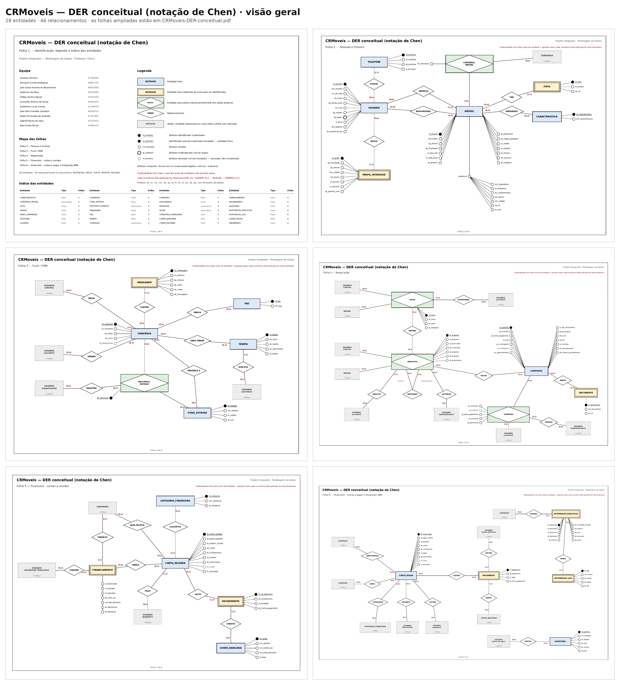

| Símbolo | Significado |
|---|---|
| Retângulo | Entidade forte |
| Retângulo duplo | Entidade fraca |
| Retângulo com losango | Entidade associativa |
| Losango | Relacionamento |
| Círculo preenchido | Identificador (sublinhado) ou identificador parcial (sublinhado tracejado) |
| Círculo vazio | Atributo simples |
| Círculo duplo | Atributo multivalorado |
| Círculo tracejado | Atributo derivado |
| Caixa cinza tracejada | Atalho para entidade de outra folha |

**Convenção de cardinalidade:** o par (mín,máx) junto de uma entidade indica quantas vezes cada ocorrência dela participa do relacionamento (seção 14). A legenda da Folha 1 traz a mesma convenção.

### Folha 1 — Identificação, legenda e índice das entidades

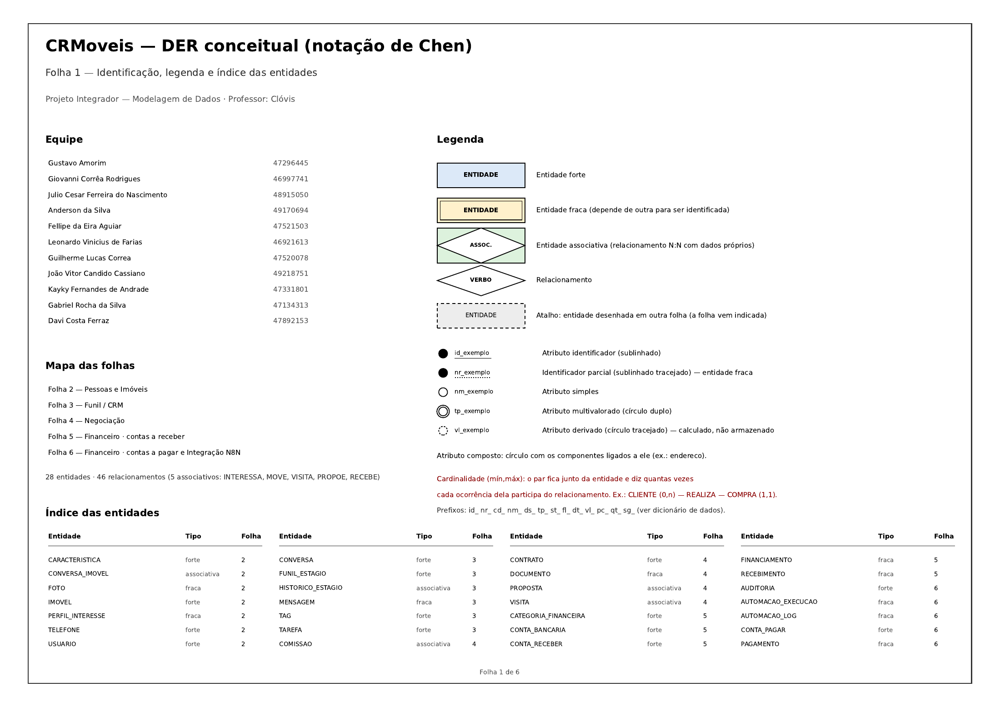

### Folha 2 — Pessoas e Imóveis

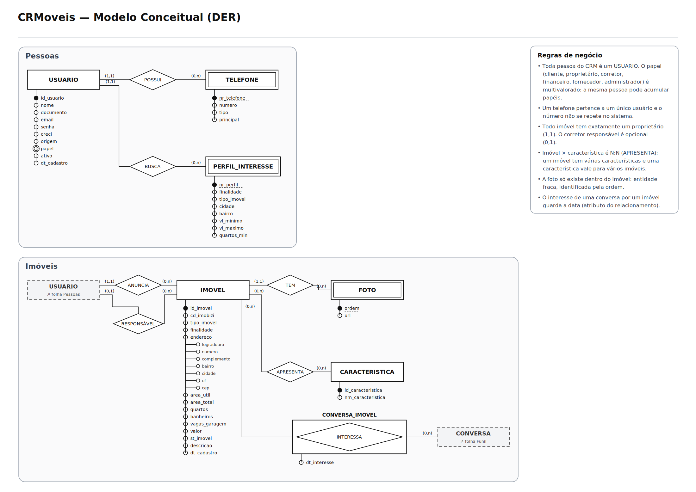

### Folha 3 — Funil / CRM

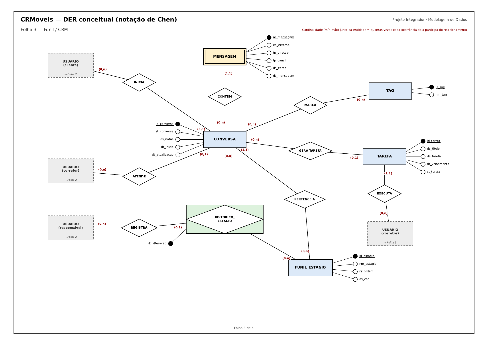

### Folha 4 — Negociação

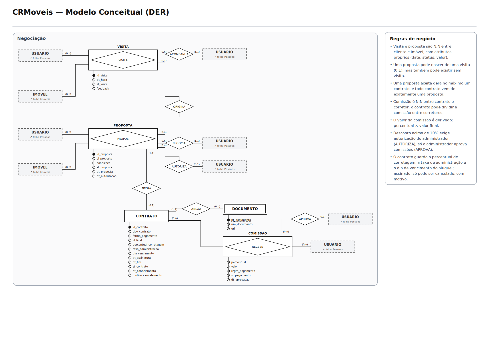

### Folha 5 — Financeiro · contas a receber

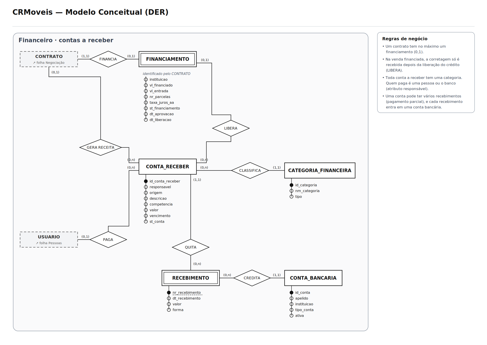

### Folha 6 — Financeiro · contas a pagar e Integração N8N

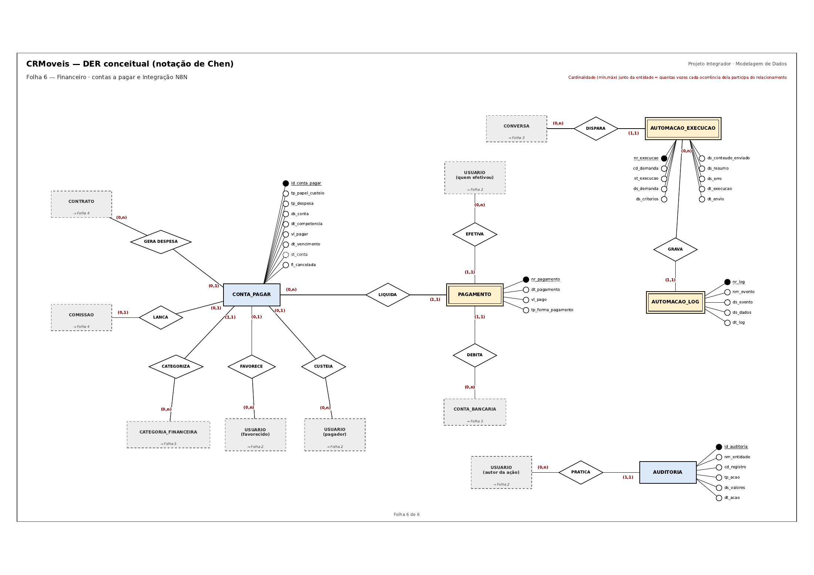

## 17. Justificativas técnicas

As principais decisões de modelagem, no formato pedido pelo manual.

### 17.1 Uma única entidade USUARIO para todas as pessoas e instituições

| | |
|---|---|
| **O que decidimos** | Cliente, proprietário, inquilino, corretor, financeiro, fornecedor, administrador e banco são a mesma entidade, com o papel como atributo multivalorado. USUARIO significa qualquer pessoa ou instituição cadastrada no CRM, tenha ou não acesso ao sistema. |
| **Por que decidimos assim** | A mesma pessoa pode ter vários papéis (o proprietário que também quer comprar), e separar em entidades duplicaria cadastro e telefone. Comparamos três alternativas: (a) uma entidade por papel, descartada por duplicar o cadastro; (b) uma entidade genérica com subtipos (generalização/especialização), descartada porque os papéis se sobrepõem e mudam com o tempo, e os dados exclusivos de cada papel são poucos (CRECI e senha); (c) a escolhida, em que o risco de ligar um papel errado a um relacionamento é tratado pela regra RN32. |
| **Qual regra sustenta** | RN01, RN02, RN32, RN33 · problema “proprietário tratado como duas pessoas” |

### 17.2 TELEFONE como entidade forte

| | |
|---|---|
| **O que decidimos** | O telefone é uma entidade forte, com identificador próprio (id_telefone), ligada ao usuário por um relacionamento em que todo telefone pertence a exatamente um usuário. |
| **Por que decidimos assim** | Telefone é multivalorado e tem atributos próprios (tipo, principal). Consideramos a entidade fraca, mas o número de WhatsApp é único em todo o sistema e é por ele que a automação identifica o cliente; logo, o telefone não depende do usuário para ser identificado. Os demais números podem ser compartilhados, por isso o número comum não serve de identificador. |
| **Qual regra sustenta** | RN03 · RF03 |

### 17.3 Endereço como atributo composto

| | |
|---|---|
| **O que decidimos** | O endereço do imóvel foi decomposto em logradouro, número, complemento, bairro, cidade, UF e CEP. |
| **Por que decidimos assim** | A busca por imóvel é feita por cidade e bairro, e o perfil de interesse compara esses campos separadamente. |
| **Qual regra sustenta** | RF04, RF11, RF13 |

### 17.4 Imóvel × característica como N:N sem atributos

| | |
|---|---|
| **O que decidimos** | Ficou como losango (0,n)–(0,n), sem entidade associativa. |
| **Por que decidimos assim** | Um imóvel tem várias características e uma característica vale para vários imóveis; a relação não guarda nenhuma informação própria. |
| **Qual regra sustenta** | RN08 · Etapas 14 e 15 do manual |

### 17.5 VISITA e PROPOSTA como associativas com identificador próprio

| | |
|---|---|
| **O que decidimos** | São N:N entre cliente e imóvel, com atributos (data, situação, valor) e identificador próprio. |
| **Por que decidimos assim** | O mesmo cliente pode visitar o mesmo imóvel mais de uma vez e fazer várias propostas, então o par cliente–imóvel não basta para identificar. |
| **Qual regra sustenta** | RN16, RN17 |

### 17.6 PROPOSTA (0,1) — FECHA — (1,1) CONTRATO

| | |
|---|---|
| **O que decidimos** | Uma proposta participa de no máximo um contrato (0,1), e todo contrato nasce de exatamente uma proposta (1,1). |
| **Por que decidimos assim** | Nem toda proposta é aceita (0), e a aceita não pode gerar dois contratos (1); não existe contrato sem proposta. |
| **Qual regra sustenta** | RN18 |

### 17.7 COMISSAO como associativa entre contrato e corretor, calculada sobre a corretagem

| | |
|---|---|
| **O que decidimos** | A comissão é N:N entre contrato e corretor, com percentual, regra de pagamento e valor derivado. O valor é o percentual do corretor aplicado sobre a corretagem do contrato (vl_corretagem), e não sobre o preço do imóvel. |
| **Por que decidimos assim** | Um contrato pode dividir a comissão entre vários corretores, e um corretor recebe comissão de vários contratos. O percentual descreve a participação, não o contrato nem o corretor. A base é a corretagem porque é o que a imobiliária efetivamente recebe: aplicar a comissão sobre o preço do imóvel permitiria pagar aos corretores mais do que a imobiliária recebeu. |
| **Qual regra sustenta** | RN20, RN21 · Etapa 15 do manual |

### 17.8 FINANCIAMENTO como entidade fraca do contrato, concedido por um banco e ligado à conta a receber

| | |
|---|---|
| **O que decidimos** | O financiamento é 1:1 opcional com o contrato, é concedido por um usuário com o papel de instituição financeira (CONCEDE) e se liga à conta a receber pelo relacionamento LIBERA. |
| **Por que decidimos assim** | Na venda financiada, a corretagem só entra quando o banco libera o crédito; o sistema precisa saber de qual financiamento veio o dinheiro e qual banco o concedeu. Guardar só o nome do banco como texto impediria ligar o banco como pagador da conta a receber. |
| **Qual regra sustenta** | RN22, RN23, RN27, RN33 |

### 17.9 Contas a receber e a pagar separadas, com baixas

| | |
|---|---|
| **O que decidimos** | Receitas e despesas são entidades diferentes, e cada uma tem baixas (RECEBIMENTO e PAGAMENTO) como entidades fracas. |
| **Por que decidimos assim** | Reconhecemos que as duas se parecem (valor, vencimento, categoria, baixas). Comparamos com um lançamento único com tipo receita/despesa. Mantivemos separadas porque os relacionamentos e as regras diferem: só a conta a receber se liga ao financiamento (LIBERA) e sempre tem um pagador (PAGA); só a conta a pagar nasce de uma comissão (LANCA), tem favorecido (FAVORECE) e indica quem arca com o custo (CUSTEIA). Um lançamento único teria relacionamentos opcionais que só valem para um dos tipos. As baixas podem ser parciais e em contas bancárias diferentes. O modelo lógico poderá reavaliar a unificação como supertipo. |
| **Qual regra sustenta** | RN26, RN29 · RF26 |

### 17.10 “Quem paga” como atributo e relacionamento

| | |
|---|---|
| **O que decidimos** | As duas contas têm um atributo com o papel envolvido (tp_papel_pagador na conta a receber, tp_papel_custeio na conta a pagar) e um relacionamento com a pessoa: PAGA, obrigatório na conta a receber, e CUSTEIA, opcional na conta a pagar. |
| **Por que decidimos assim** | Quem paga varia: na venda costuma ser o vendedor; no financiamento, o banco; na locação, o inquilino. Como banco e inquilino são papéis de USUARIO, a conta a receber sempre tem um pagador. Na conta a pagar, quem paga é sempre a imobiliária; o que varia é quem arca com o custo final, e, quando é a própria imobiliária, não há pessoa a ligar. |
| **Qual regra sustenta** | RN27, RN28 |

### 17.11 Histórico do funil como associativa

| | |
|---|---|
| **O que decidimos** | HISTORICO_ESTAGIO liga conversa e estágio, identificado pela data e hora da mudança. |
| **Por que decidimos assim** | Sem histórico, mudar o estágio apagaria de onde o cliente veio, e o relatório de conversão seria impossível. |
| **Qual regra sustenta** | RN14 · RF08, RF30 |

### 17.12 Automação N8N como entidades fracas da conversa

| | |
|---|---|
| **O que decidimos** | Execução e log existem apenas ligados a uma conversa, identificados por números sequenciais. |
| **Por que decidimos assim** | São entidades de apoio à integração: registram cada processamento para a resposta automática e garantem que a mesma demanda não seja processada duas vezes, o que é regra de negócio (RN31). A mesma garantia vale para as mensagens, por meio do código externo do WhatsApp (MENSAGEM.cd_externo). |
| **Qual regra sustenta** | RF11, RF12 · RN31 |

### 17.13 Aprovações como relacionamentos 1:N

| | |
|---|---|
| **O que decidimos** | AUTORIZA liga o administrador à proposta e APROVA liga o administrador à comissão. Em ambos, a proposta ou a comissão participa no máximo uma vez (0,1) e o administrador pode participar várias (0,n). A data fica como atributo do relacionamento. |
| **Por que decidimos assim** | As políticas exigem saber quem aprovou. Como cada proposta ou comissão tem no máximo um aprovador, a data da aprovação é representada junto da proposta e da comissão. |
| **Qual regra sustenta** | PO01, PO03 |

### 17.14 Nomes únicos para os relacionamentos

| | |
|---|---|
| **O que decidimos** | Cada relacionamento tem um nome próprio, em maiúsculas e sem acento, como as entidades (GERA TAREFA, GERA RECEITA, GERA DESPESA, QUITA, LIQUIDA, CLASSIFICA, CATEGORIZA…). |
| **Por que decidimos assim** | Com nomes repetidos, uma pergunta como “por que existe o GERA?” ficaria ambígua. O nome passa a identificar a relação sem precisar citar as entidades. |
| **Qual regra sustenta** | Clareza das justificativas |

### 17.15 DER dividido em folhas com atalhos

| | |
|---|---|
| **O que decidimos** | O DER foi desenhado em seis folhas por domínio; entidades de outra folha aparecem como atalho tracejado. |
| **Por que decidimos assim** | Com 28 entidades e a pessoa ligada a quase tudo, uma folha única teria linhas cruzando e letra ilegível. Os atalhos mantêm cada linha curta e sem ambiguidade. |
| **Qual regra sustenta** | Legibilidade e consistência do modelo |

### 17.16 Estágio atual (PERTENCE A) e histórico do funil juntos

| | |
|---|---|
| **O que decidimos** | A conversa mantém o relacionamento PERTENCE A com o estágio atual e, ao mesmo tempo, o HISTORICO_ESTAGIO registra todas as passagens. O estágio atual é sempre o do registro mais recente do histórico. |
| **Por que decidimos assim** | O estágio atual é consultado o tempo todo (quadro do funil), e guardá-lo na própria conversa evita procurar o último registro do histórico. O histórico continua necessário para o relatório de conversão. A redundância é controlada pela regra RN14: toda mudança grava o histórico e atualiza o estágio na mesma operação. |
| **Qual regra sustenta** | RN13, RN14 · RF07, RF08, RF30 |

### 17.17 Inquilino e instituição financeira como papéis de USUARIO

| | |
|---|---|
| **O que decidimos** | O inquilino e o banco são papéis de USUARIO. O inquilino é o cliente com contrato de locação assinado; o banco é o usuário que concede um financiamento. |
| **Por que decidimos assim** | As regras RN27 e RN28 tratam inquilino e banco como pagadores, mas eles não constavam entre os papéis. Sem isso, o relacionamento PAGA ficaria vazio justamente no financiamento e na locação. |
| **Qual regra sustenta** | RN27, RN28, RN33 |

### 17.18 Contraproposta como relacionamento recursivo

| | |
|---|---|
| **O que decidimos** | A contraproposta é uma nova PROPOSTA ligada à proposta que ela responde (RESPONDE, recursivo, 0,1 nos dois lados). A proposta respondida passa à situação “substituída”. |
| **Por que decidimos assim** | Uma situação “contraproposta” num único registro perdia a sequência da negociação. Com cada rodada em uma linha, com valor e data, a negociação pode ser reconstruída. |
| **Qual regra sustenta** | RN35 · RF19 |

### 17.19 Valor anunciado guardado na proposta

| | |
|---|---|
| **O que decidimos** | A PROPOSTA guarda o valor anunciado do imóvel no momento em que foi feita (vl_anunciado). |
| **Por que decidimos assim** | O limite de desconto de 10% é medido contra o valor anunciado. Como o preço do imóvel pode mudar depois, sem esse atributo não seria possível conferir por que uma proposta exigiu autorização. |
| **Qual regra sustenta** | PO03 · RF19 |

### 17.20 Situação das contas e da comissão como dados derivados

| | |
|---|---|
| **O que decidimos** | “Parcial”, “recebida/paga” e “atrasada” (contas) e “paga” (comissão) não são gravadas: são calculadas. Só o cancelamento é registrado (fl_cancelada; st_comissao). |
| **Por que decidimos assim** | Gravar essas situações duplicaria o que já está nas baixas e no vencimento e permitiria dados contraditórios, como uma conta marcada como recebida com baixas menores que o valor. |
| **Qual regra sustenta** | RN29, RN38 |

### 17.21 Cancelamento do contrato sem exclusão

| | |
|---|---|
| **O que decidimos** | O contrato não é excluído: passa à situação “cancelado”, com data e motivo. As contas sem baixa e as comissões não pagas são canceladas, e as baixas já feitas são mantidas. |
| **Por que decidimos assim** | Apagar o contrato deixaria contas, recebimentos e comissões sem origem. Valores já movimentados não podem desaparecer; qualquer devolução é um novo lançamento. |
| **Qual regra sustenta** | RN37, PO04 · RF33 |

### 17.22 Auditoria como entidade própria

| | |
|---|---|
| **O que decidimos** | AUDITORIA é uma entidade que registra usuário (PRATICA), data, ação e valores, e aponta para o registro afetado pelo nome da entidade e pelo código, sem relacionamento direto com cada entidade. O relacionamento EFETIVA guarda quem realizou cada pagamento. |
| **Por que decidimos assim** | O requisito de auditoria exige saber quem criou ou alterou contratos, propostas, comissões e lançamentos. Um relacionamento com cada uma dessas entidades poluiria o DER; a referência genérica é uma escolha consciente, que o modelo lógico poderá detalhar. A política PO01 exige saber quem pagou a comissão, e por isso EFETIVA existe. |
| **Qual regra sustenta** | RN39, RN40, PO01 · RF34, RNF04 |

### 17.23 Anonimização de dados pessoais

| | |
|---|---|
| **O que decidimos** | No pedido de exclusão do titular, quem tem contrato, lançamento financeiro ou obrigação legal de guarda é anonimizado (o registro permanece, sem nome, documento, e-mail e telefones); os demais cadastros podem ser excluídos. |
| **Por que decidimos assim** | Contratos e finanças referenciam o usuário e não podem ser apagados (PO04). A anonimização concilia o direito do titular com o dever de guardar os registros, e dt_anonimizacao mostra quando ocorreu. |
| **Qual regra sustenta** | PO07 · RNF03, RF35 |

### 17.24 Finalidade e valores do imóvel

| | |
|---|---|
| **O que decidimos** | O imóvel aceita a finalidade venda, locação ou ambas, com vl_venda e vl_aluguel obrigatórios conforme a finalidade. |
| **Por que decidimos assim** | Um mesmo imóvel pode ser ofertado para venda e para locação. Com um único valor, seria preciso cadastrar duas vezes a mesma unidade. |
| **Qual regra sustenta** | RF13 |

## 18. Conclusão

O modelo conceitual do CRMoveis foi construído na ordem pedida pelo manual: a caracterização da imobiliária levou aos processos, os processos revelaram os problemas, os problemas viraram requisitos e regras, e as regras definiram as entidades, os relacionamentos e as cardinalidades do DER. Cada decisão aponta para o requisito ou a regra que a sustenta.

O modelo, com 28 entidades e 46 relacionamentos, integra atendimento, imóveis, negociação e financeiro, e foi pensado para evoluir: a próxima etapa é o modelo lógico, que já tem uma prévia em [`docs/modelo-logico/`](docs/modelo-logico/) com as tabelas, chaves primárias e estrangeiras.

**Fora do escopo desta entrega:** copropriedade de imóveis (vários proprietários), fiador e caução, reajuste anual do aluguel e multa e juros por atraso. Essas situações não tiveram regra levantada nesta etapa e podem ser incorporadas nas próximas.

## Arquivos do repositório

```
CRMoveis/
├── README.md
└── docs/
    ├── der/
    │   ├── CRMoveis-DER-conceitual.pdf     # DER em 6 folhas A3
    │   ├── visao-geral.png                  # todas as folhas numa imagem
    │   └── folha-1.png … folha-6.png        # imagens usadas neste README
    ├── fluxogramas/
    │   ├── CRMoveis-fluxogramas.pdf        # 5 fluxogramas em A4
    │   └── fluxo-1.png … fluxo-5.png
    ├── requisitos/
    │   ├── CRMoveis-requisitos-e-regras.pdf
    │   └── CRMoveis-requisitos-e-regras.md
    └── modelo-logico/                       # prévia da próxima etapa
        ├── CRMoveis-modelo-logico-ampliado.pdf
        ├── crmoveis.dbml                    # colar em dbdiagram.io
        └── crmoveis.mmd                     # Mermaid, para Miro ou mermaid.live
```
