# Projeto ERP — CRMoveis

> CRM para imobiliária de venda e locação de imóveis, integrado ao WhatsApp e ao N8N. Primeira entrega do Projeto Integrador de Modelagem de Dados: do problema real ao modelo conceitual.

## Sumário

- [1. Identificação da equipe](#1-identificação-da-equipe)
- [2. Caracterização da empresa](#2-caracterização-da-empresa)
- [3. Justificativa da escolha](#3-justificativa-da-escolha)
- [4. Problemas identificados](#4-problemas-identificados)
- [5. Processos de negócio](#5-processos-de-negócio)
- [6. Requisitos funcionais](#6-requisitos-funcionais)
- [7. Requisitos não funcionais](#7-requisitos-não-funcionais)
- [8. Regras de negócio](#8-regras-de-negócio)
- [9. Restrições e políticas organizacionais](#9-restrições-e-políticas-organizacionais)
- [10. Fluxogramas](#10-fluxogramas)
- [11. Entidades](#11-entidades)
- [12. Atributos](#12-atributos)
- [13. Relacionamentos](#13-relacionamentos)
- [14. Cardinalidades](#14-cardinalidades)
- [15. Dicionário de dados conceitual](#15-dicionário-de-dados-conceitual)
- [16. DER](#16-der)
- [17. Justificativas técnicas](#17-justificativas-técnicas)
- [18. Conclusão](#18-conclusão)
- [Arquivos do repositório](#arquivos-do-repositório)

## 1. Identificação da equipe

**Disciplina:** Projeto Integrador — Modelagem de Dados · **Professor:** Clóvis

| Integrante | RGM |
|---|---|
| Gustavo Amorim | 47296445 |
| Giovanni Corrêa Rodrigues | 46997741 |
| Julio Cesar Ferreira do Nascimento | 48915050 |
| Anderson da Silva | 49170694 |
| Fellipe da Eira Aguiar | 47521503 |
| Leonardo Vinicius de Farias | 46921613 |
| Guilherme Lucas Correa | 47520078 |
| João Vitor Candido Cassiano | 49218751 |
| Kayky Fernandes de Andrade | 47331801 |
| Gabriel Rocha da Silva | 47134313 |
| Davi Costa Ferraz | 47892153 |

## 2. Caracterização da empresa

| Item | Descrição |
|---|---|
| **Nome** | CRMoveis — nome adotado pela equipe para o projeto e para a solução |
| **Segmento** | Imobiliária de pequeno porte, com atuação em venda e locação de imóveis residenciais e comerciais |
| **O que oferece** | Intermediação de venda, intermediação de locação e administração de aluguéis (cobrança do inquilino e repasse ao proprietário) |
| **Principais clientes** | Pessoas que querem comprar ou alugar um imóvel, proprietários que querem vender ou alugar, e inquilinos de imóveis administrados |
| **Principais setores** | Atendimento e vendas (corretores), captação de imóveis, administração de locações, financeiro e gestão |
| **Informações importantes** | Clientes e proprietários, imóveis e suas características, histórico de atendimento, visitas, propostas, contratos, financiamentos, comissões, contas a receber e contas a pagar |

**Como funciona hoje.** Hoje o primeiro contato do cliente acontece pelo WhatsApp de cada corretor. Os imóveis ficam cadastrados no IMOBIZI, mas visitas e propostas são anotadas em planilhas ou no próprio celular. Quando uma venda ou locação é fechada, a comissão é calculada à mão, o andamento do financiamento é acompanhado por fora e as contas a pagar e a receber ficam em uma planilha separada. Na locação, o aluguel recebido e o repasse ao proprietário também são controlados manualmente.

## 3. Justificativa da escolha

Escolhemos uma imobiliária de venda e locação porque o negócio reúne processos bem definidos e interligados — atendimento de clientes, captação de imóveis, visitas, propostas, contratos, financiamento e repasses mensais — que hoje ficam espalhados entre WhatsApp, planilhas e o sistema de anúncios. Isso gera clientes esquecidos, cadastros duplicados, comissões calculadas à mão e pouca visão do que entra e sai do caixa, o que mostra uma necessidade real de integração e torna o caso adequado a um sistema ERP. Também quisemos sair dos exemplos mais comuns (lanchonete, pet shop, loja) e enfrentar um modelo com vários relacionamentos N:N e um módulo financeiro com regras próprias.

| O manual pede que a empresa tenha… | No caso da imobiliária |
|---|---|
| processos que possam ser analisados | Cinco processos principais, do primeiro contato ao repasse do aluguel (seção 5) |
| problemas de organização das informações | Dez problemas levantados, de cadastro duplicado a comissão calculada à mão (seção 4) |
| necessidade de integração | Atendimento, imóveis, negociação e financeiro dependem uns dos outros |
| possibilidade de aplicação de um ERP | Um sistema único cobre cadastro, funil, contratos e financeiro |

## 4. Problemas identificados

| Problema | Consequência | Necessidade |
|---|---|---|
| Atendimento feito no WhatsApp pessoal de cada corretor | O histórico se perde quando o corretor sai e o cliente pode ser atendido duas vezes | Centralizar conversas e mensagens por cliente |
| O mesmo cliente cadastrado em planilha, no IMOBIZI e no celular | Duplicidade e dados desencontrados | Cadastro único de pessoas |
| Proprietário que também quer comprar é tratado como duas pessoas | Informação duplicada e contatos errados | Uma pessoa com vários papéis |
| Visitas e propostas anotadas em papel ou planilha | Não se sabe quantas visitas viram proposta; retrabalho | Registrar visitas e propostas ligadas ao cliente e ao imóvel |
| Não existe visão do funil de vendas | Clientes esquecidos e sem acompanhamento | Funil com estágios e histórico de mudanças |
| Comissões calculadas manualmente | Erros de valor e conflitos entre corretores | Comissão com percentual e regra de pagamento |
| Financiamento acompanhado fora do sistema | Comissão paga antes de o banco liberar o crédito | Registrar o financiamento e a data de liberação |
| Contas a pagar e a receber em planilha separada | Difícil saber quanto entra, quanto sai e quem deve pagar | Contas a receber e a pagar com responsável e baixas |
| Repasse do aluguel controlado à mão | Atraso no repasse ao proprietário | Gerar todo mês o aluguel e o repasse |
| Relatórios montados manualmente | Demora e informação desatualizada | Relatórios de funil e financeiros a partir dos dados |

## 5. Processos de negócio

### P1 — Atendimento de um novo contato pelo WhatsApp

| | |
|---|---|
| **Quem participa** | Cliente, automação N8N e corretor |
| **O que inicia** | O cliente manda mensagem no WhatsApp da imobiliária |
| **O que acontece** | O sistema identifica o cliente pelo telefone (ou o cadastra), abre ou retoma a conversa, registra a mensagem, interpreta a demanda, sugere imóveis compatíveis ou cria uma tarefa para o corretor e posiciona a conversa no funil |
| **Informação gerada** | Usuário, telefone, conversa, mensagens, execução da automação, interesse em imóveis, histórico do funil e tarefa |
| **Resultado** | O contato fica registrado, atendido e posicionado no funil |
| **Fluxograma** | [F1](#10-fluxogramas) |

### P2 — Captação de imóvel

| | |
|---|---|
| **Quem participa** | Proprietário e corretor |
| **O que inicia** | O proprietário procura a imobiliária para vender ou alugar |
| **O que acontece** | O proprietário é cadastrado (ou tem o papel acrescentado), o imóvel é registrado com endereço, características e fotos, a documentação é conferida e um corretor responsável é definido |
| **Informação gerada** | Usuário com papel proprietário, imóvel, características, fotos e tarefa de pendência |
| **Resultado** | O imóvel é publicado como disponível |
| **Fluxograma** | [F2](#10-fluxogramas) |

### P3 — Visita e proposta

| | |
|---|---|
| **Quem participa** | Cliente, corretor e proprietário |
| **O que inicia** | O cliente pede para visitar um imóvel |
| **O que acontece** | O sistema verifica se o imóvel está disponível, agenda a visita, registra a realização e o feedback, registra a proposta e as contrapropostas até o aceite |
| **Informação gerada** | Visita, feedback, proposta e contraproposta |
| **Resultado** | Proposta aceita, pronta para virar contrato |
| **Fluxograma** | [F3](#10-fluxogramas) |

### P4 — Venda: contrato, financiamento e comissão

| | |
|---|---|
| **Quem participa** | Comprador, proprietário (vendedor), corretor, banco e financeiro |
| **O que inicia** | Uma proposta de venda é aceita |
| **O que acontece** | O contrato é gerado; se houver financiamento, ele é registrado e acompanhado até a liberação do crédito; a corretagem vira conta a receber; após o recebimento, a comissão é liberada e paga ao corretor |
| **Informação gerada** | Contrato, documentos, financiamento, conta a receber, recebimento, comissão, conta a pagar e pagamento |
| **Resultado** | Imóvel vendido, corretagem recebida e comissão paga |
| **Fluxograma** | [F4](#10-fluxogramas) |

### P5 — Locação: ciclo mensal do aluguel

| | |
|---|---|
| **Quem participa** | Inquilino, proprietário e financeiro |
| **O que inicia** | Todo mês, enquanto o contrato de locação estiver vigente |
| **O que acontece** | O sistema gera a conta do aluguel, acompanha o pagamento do inquilino, registra o recebimento, retém a taxa de administração e gera e paga o repasse ao proprietário |
| **Informação gerada** | Conta a receber do aluguel, recebimento, conta a pagar do repasse e pagamento |
| **Resultado** | O proprietário recebe o repasse e a imobiliária fica com a taxa de administração |
| **Fluxograma** | [F5](#10-fluxogramas) |

## 6. Requisitos funcionais

O que o sistema deve fazer. A coluna *Fluxo* indica em qual fluxograma o requisito aparece.

### Pessoas

| Código | Requisito | Fluxo | Entidades |
|---|---|---|---|
| RF01 | O sistema deverá cadastrar usuários com nome, documento (CPF/CNPJ), e-mail e origem do contato. | F1, F2 | USUARIO |
| RF02 | O sistema deverá permitir que um mesmo usuário exerça mais de um papel: cliente, proprietário, corretor, financeiro, fornecedor ou administrador. | F1, F2 | USUARIO (papel) |
| RF03 | O sistema deverá registrar um ou mais telefones por usuário e identificar o usuário pelo número do WhatsApp. | F1 | TELEFONE |
| RF04 | O sistema deverá registrar os perfis de interesse do cliente: finalidade, tipo de imóvel, cidade, bairro, faixa de valor e quartos. | F1 | PERFIL_INTERESSE |

### Atendimento e funil

| Código | Requisito | Fluxo | Entidades |
|---|---|---|---|
| RF05 | O sistema deverá receber as mensagens do WhatsApp, por meio do N8N, e registrá-las na conversa do cliente. | F1 | CONVERSA, MENSAGEM |
| RF06 | O sistema deverá abrir uma nova conversa ou retomar a conversa existente do cliente. | F1 | CONVERSA |
| RF07 | O sistema deverá posicionar cada conversa em um estágio do funil de vendas e permitir movê-la entre estágios. | F1 | FUNIL_ESTAGIO |
| RF08 | O sistema deverá registrar cada mudança de estágio, com data, hora e usuário responsável. | F1 | HISTORICO_ESTAGIO |
| RF09 | O sistema deverá permitir classificar conversas com etiquetas (tags). | — | TAG |
| RF10 | O sistema deverá criar tarefas para os corretores, com prazo e situação, ligadas ou não a uma conversa. | F1, F2, F4 | TAREFA |
| RF11 | O sistema deverá interpretar a demanda do cliente e sugerir automaticamente imóveis compatíveis com o perfil de interesse. | F1 | AUTOMACAO_EXECUCAO, CONVERSA_IMOVEL |
| RF12 | O sistema deverá registrar cada execução da automação e os eventos técnicos de cada execução. | F1 | AUTOMACAO_EXECUCAO, AUTOMACAO_LOG |

### Imóveis

| Código | Requisito | Fluxo | Entidades |
|---|---|---|---|
| RF13 | O sistema deverá cadastrar imóveis com endereço, características, valor, finalidade (venda ou locação) e situação. | F2 | IMOVEL, CARACTERISTICA |
| RF14 | O sistema deverá importar e atualizar os imóveis a partir do IMOBIZI. | F2 | IMOVEL |
| RF15 | O sistema deverá anexar fotos aos imóveis, na ordem de exibição. | F2 | FOTO |
| RF16 | O sistema deverá registrar o proprietário e o corretor responsável de cada imóvel. | F2 | IMOVEL, USUARIO |
| RF17 | O sistema deverá registrar os imóveis de interesse de cada conversa. | F1 | CONVERSA_IMOVEL |

### Negociação

| Código | Requisito | Fluxo | Entidades |
|---|---|---|---|
| RF18 | O sistema deverá agendar, registrar a realização e cancelar visitas, guardando o feedback do cliente. | F3 | VISITA |
| RF19 | O sistema deverá registrar propostas e contrapropostas, ligadas ou não a uma visita. | F3 | PROPOSTA |
| RF20 | O sistema deverá gerar o contrato de venda ou de locação a partir de uma proposta aceita, com percentual de corretagem ou taxa de administração. | F3, F4 | CONTRATO |
| RF21 | O sistema deverá anexar documentos ao contrato. | F4 | DOCUMENTO |
| RF22 | O sistema deverá registrar a comissão de cada corretor no contrato, com percentual, regra de pagamento e aprovação do administrador. | F4 | COMISSAO |

### Financeiro

| Código | Requisito | Fluxo | Entidades |
|---|---|---|---|
| RF23 | O sistema deverá registrar o financiamento do contrato: instituição, valor financiado, entrada, parcelas, taxa, aprovação e liberação do crédito. | F4 | FINANCIAMENTO |
| RF24 | O sistema deverá gerar contas a receber (corretagem, intermediação, taxa de administração, aluguel e serviços), indicando quem paga. | F4, F5 | CONTA_RECEBER |
| RF25 | O sistema deverá gerar contas a pagar (comissão, repasse ao proprietário, despesas e impostos), indicando quem paga e quem recebe. | F4, F5 | CONTA_PAGAR |
| RF26 | O sistema deverá registrar recebimentos e pagamentos, inclusive parciais, indicando a conta bancária movimentada. | F4, F5 | RECEBIMENTO, PAGAMENTO, CONTA_BANCARIA |
| RF27 | O sistema deverá gerar todo mês, nos contratos de locação, a conta a receber do aluguel e a conta a pagar do repasse ao proprietário. | F5 | CONTA_RECEBER, CONTA_PAGAR |
| RF28 | O sistema deverá liberar a comissão para pagamento somente quando a condição da regra de pagamento for atendida. | F4 | COMISSAO, CONTA_PAGAR |
| RF29 | O sistema deverá classificar cada conta a receber e a pagar em uma categoria financeira. | F4, F5 | CATEGORIA_FINANCEIRA |

### Consultas e relatórios

| Código | Requisito | Fluxo | Entidades |
|---|---|---|---|
| RF30 | O sistema deverá emitir relatório de conversão do funil por estágio e por período. | — | HISTORICO_ESTAGIO |
| RF31 | O sistema deverá emitir relatório financeiro com valores a receber, recebidos, a pagar e pagos por período. | — | CONTA_RECEBER, CONTA_PAGAR |
| RF32 | O sistema deverá permitir consultar o histórico de atendimentos, visitas, propostas e contratos de um cliente. | — | CONVERSA, VISITA, PROPOSTA, CONTRATO |

## 7. Requisitos não funcionais

Como o sistema deve funcionar. Os valores de tempo e disponibilidade são metas propostas pela equipe.

| Código | Categoria | Requisito |
|---|---|---|
| RNF01 | Controle de acesso | O sistema deverá controlar o acesso por perfil (administrador, corretor e financeiro), liberando a cada perfil apenas as funções e os dados de que ele precisa. |
| RNF02 | Segurança | O sistema deverá armazenar as senhas somente na forma de hash, nunca em texto. |
| RNF03 | Privacidade (LGPD) | O sistema deverá tratar os dados pessoais (CPF/CNPJ, telefone e e-mail) conforme a LGPD, permitindo consultar e excluir os dados do titular quando ele solicitar. |
| RNF04 | Auditoria | O sistema deverá registrar quem criou ou alterou contratos, propostas, comissões e lançamentos financeiros, e quando. |
| RNF05 | Tempo de resposta | O sistema deverá enviar a resposta automática ao cliente no WhatsApp em até 10 segundos após o recebimento da mensagem, em condições normais de uso. |
| RNF06 | Desempenho | As consultas de cadastro, funil e contas deverão ser apresentadas em até 3 segundos, para uso no atendimento. |
| RNF07 | Disponibilidade | O sistema deverá funcionar 24 horas por dia, com meta de 99% de disponibilidade mensal, porque o atendimento pelo WhatsApp acontece também fora do horário comercial. |
| RNF08 | Confiabilidade | O sistema não deverá processar a mesma demanda da automação mais de uma vez. |
| RNF09 | Cópia de segurança | O banco de dados deverá ter cópia de segurança diária, guardada por pelo menos 30 dias. |
| RNF10 | Usabilidade | O sistema deverá ser web e responsivo, utilizável no celular pelos corretores durante visitas. |
| RNF11 | Integração | A integração com o WhatsApp e com o IMOBIZI deverá ocorrer por meio do N8N, sem redigitação manual dos dados. |
| RNF12 | Precisão financeira | Os valores financeiros deverão ser armazenados com duas casas decimais, sem arredondamentos intermediários nos cálculos de comissão e repasse. |

## 8. Regras de negócio

O que pode ou não pode acontecer. A última coluna mostra onde a regra aparece no DER.

### Pessoas

| Código | Regra | Onde aparece no modelo |
|---|---|---|
| RN01 | Toda pessoa registrada no CRM é um usuário e deve ter pelo menos um papel. | USUARIO · papel obrigatório |
| RN02 | A mesma pessoa pode exercer vários papéis ao mesmo tempo, por exemplo ser cliente e proprietária. | papel multivalorado |
| RN03 | Um telefone pertence a um único usuário, e o mesmo número não pode se repetir no sistema. | USUARIO (1,1) — TELEFONE (0,n) · número único |
| RN04 | O documento (CPF/CNPJ) não pode se repetir e é obrigatório para proprietários e para quem assina contrato. | USUARIO.documento único |
| RN05 | Um cliente pode ter nenhum ou vários perfis de interesse. | USUARIO (1,1) — PERFIL_INTERESSE (0,n) |

### Imóveis

| Código | Regra | Onde aparece no modelo |
|---|---|---|
| RN06 | Todo imóvel tem exatamente um proprietário, e um proprietário pode ter vários imóveis. | USUARIO (1,1) — ANUNCIA — IMOVEL (0,n) |
| RN07 | Um imóvel pode ter nenhum ou um corretor responsável, e um corretor pode ser responsável por vários imóveis. | USUARIO (0,1) — RESPONSÁVEL — IMOVEL (0,n) |
| RN08 | Um imóvel pode ter várias características, e uma característica pode estar em vários imóveis. | IMOVEL (0,n) — APRESENTA — CARACTERISTICA (0,n) |
| RN09 | Uma foto só existe vinculada a um imóvel. | FOTO · entidade fraca |
| RN10 | Imóvel vendido, alugado ou inativo não pode receber novas visitas nem propostas. | IMOVEL.st_imovel |

### Atendimento e funil

| Código | Regra | Onde aparece no modelo |
|---|---|---|
| RN11 | Toda conversa pertence a exatamente um cliente, e um cliente pode ter várias conversas. | USUARIO (1,1) — INICIA — CONVERSA (0,n) |
| RN12 | A conversa pode ficar sem corretor no início do atendimento, mas nunca terá mais de um corretor responsável. | USUARIO (0,1) — ATENDE — CONVERSA (0,n) |
| RN13 | Toda conversa está em exatamente um estágio do funil por vez. | CONVERSA (0,n) — ESTÁ EM — FUNIL_ESTAGIO (1,1) |
| RN14 | Toda mudança de estágio deve gerar um registro no histórico, com data e hora. | HISTORICO_ESTAGIO |
| RN15 | Toda tarefa tem um corretor responsável e pode ou não estar ligada a uma conversa. | EXECUTA (1,1) · GERA TAREFA (0,1) |

### Negociação

| Código | Regra | Onde aparece no modelo |
|---|---|---|
| RN16 | Uma visita envolve exatamente um cliente, um imóvel e um corretor; o mesmo cliente pode visitar o mesmo imóvel mais de uma vez, em datas diferentes. | VISITA · associativa · único (imóvel, cliente, data e hora) |
| RN17 | Uma proposta pode ou não ter origem em uma visita. | VISITA (0,1) — ORIGINA — PROPOSTA (0,n) |
| RN18 | Uma proposta aceita gera no máximo um contrato, e todo contrato nasce de exatamente uma proposta. | PROPOSTA (1,1) — FECHA — CONTRATO (0,1) |
| RN19 | Todo contrato é de venda ou de locação, e o contrato de locação deve ter data de término, taxa de administração e dia de vencimento do aluguel. | CONTRATO.tipo_contrato, dt_fim, taxa_administracao, dia_vencimento |
| RN20 | A comissão de um contrato pode ser dividida entre vários corretores, e a soma dos percentuais não pode passar de 100%. | CONTRATO (0,n) — COMISSAO — USUARIO (0,n) |
| RN21 | O valor da comissão é o percentual aplicado sobre o valor final do contrato. | COMISSAO.valor · derivado |

### Financeiro

| Código | Regra | Onde aparece no modelo |
|---|---|---|
| RN22 | Um contrato pode ter no máximo um financiamento. | CONTRATO (1,1) — FINANCIA — FINANCIAMENTO (0,1) |
| RN23 | Na venda financiada, a corretagem só é considerada recebida depois que o banco libera o crédito. | FINANCIAMENTO (0,1) — LIBERA — CONTA_RECEBER (0,n) |
| RN24 | A comissão só é liberada para pagamento quando a condição da regra de pagamento é atendida: na assinatura, na liberação do crédito ou no recebimento. | COMISSAO.regra_pagamento |
| RN25 | Cada comissão liberada gera no máximo uma conta a pagar ao corretor. | COMISSAO (0,1) — LANÇA — CONTA_PAGAR (0,1) |
| RN26 | Toda conta a receber e toda conta a pagar deve ter uma categoria financeira e um responsável pelo pagamento. | CLASSIFICA e CATEGORIZA (1,1) · responsavel obrigatório |
| RN27 | Na conta a receber, quem paga pode ser o cliente, o inquilino, o proprietário ou o banco; quando for o banco, a conta deve estar ligada a um financiamento. | CONTA_RECEBER.responsavel |
| RN28 | Na conta a pagar, quem paga pode ser a imobiliária, o proprietário ou o inquilino; quando não for a imobiliária, o pagador deve ser informado. | CONTA_PAGAR.responsavel · USUARIO (0,1) — CUSTEIA |
| RN29 | Uma conta pode ser quitada em vários recebimentos ou pagamentos parciais, e cada um deve indicar a conta bancária movimentada. | QUITA e LIQUIDA (1,1)–(0,n) · CREDITA e DEBITA (1,1) |
| RN30 | Na locação, o aluguel recebido do inquilino gera, no mesmo mês, o repasse ao proprietário, descontada a taxa de administração. | CONTRATO.taxa_administracao · CONTA_RECEBER → CONTA_PAGAR |

### Automação

| Código | Regra | Onde aparece no modelo |
|---|---|---|
| RN31 | A mesma demanda de uma conversa não pode ser processada duas vezes pela automação. | AUTOMACAO_EXECUCAO · único (conversa, chave_demanda) |

## 9. Restrições e políticas organizacionais

Decisões da imobiliária que o sistema precisa respeitar. Os limites (10% e 5 dias úteis) são propostas da equipe.

| Código | Tipo | Descrição | Área |
|---|---|---|---|
| PO01 | Política | Somente o administrador pode aprovar e pagar comissões (relacionamento APROVA). | Financeiro |
| PO02 | Política | O corretor só pode alterar as conversas, visitas e propostas sob sua responsabilidade. | Atendimento e negociação |
| PO03 | Restrição | Proposta com desconto acima de 10% do valor anunciado exige autorização do administrador (relacionamento AUTORIZA). | Negociação |
| PO04 | Restrição | Contrato assinado não pode ser excluído; apenas cancelado, com data e motivo do cancelamento. | Negociação |
| PO05 | Restrição | O repasse ao proprietário deve ser pago em até 5 dias úteis após o recebimento do aluguel. | Financeiro |
| PO06 | Política | Dados financeiros e documentos pessoais só podem ser consultados pelos perfis administrador e financeiro. | Acesso à informação |

## 10. Fluxogramas

Cada fluxograma tem início, fim, atividades e decisões. O arquivo completo está em [`docs/fluxogramas/CRMoveis-fluxogramas.pdf`](CRMoveis/docs/fluxogramas/CRMoveis-fluxogramas.pdf).

| Fluxo | Processo | Requisitos atendidos | Regras respeitadas |
|---|---|---|---|
| F1 | Atendimento de um novo contato pelo WhatsApp | RF03, RF05–RF08, RF10–RF12, RF17 | RN03, RN11–RN14, RN31 |
| F2 | Captação de imóvel | RF01, RF02, RF10, RF13–RF16 | RN01, RN02, RN06–RN09 |
| F3 | Visita e proposta | RF18–RF20 | RN10, RN16–RN18 |
| F4 | Venda: contrato, financiamento e comissão | RF20–RF26, RF28 | RN20–RN29 |
| F5 | Locação: ciclo mensal do aluguel | RF24–RF27 | RN26–RN30 |

### F1 — Atendimento de um novo contato pelo WhatsApp

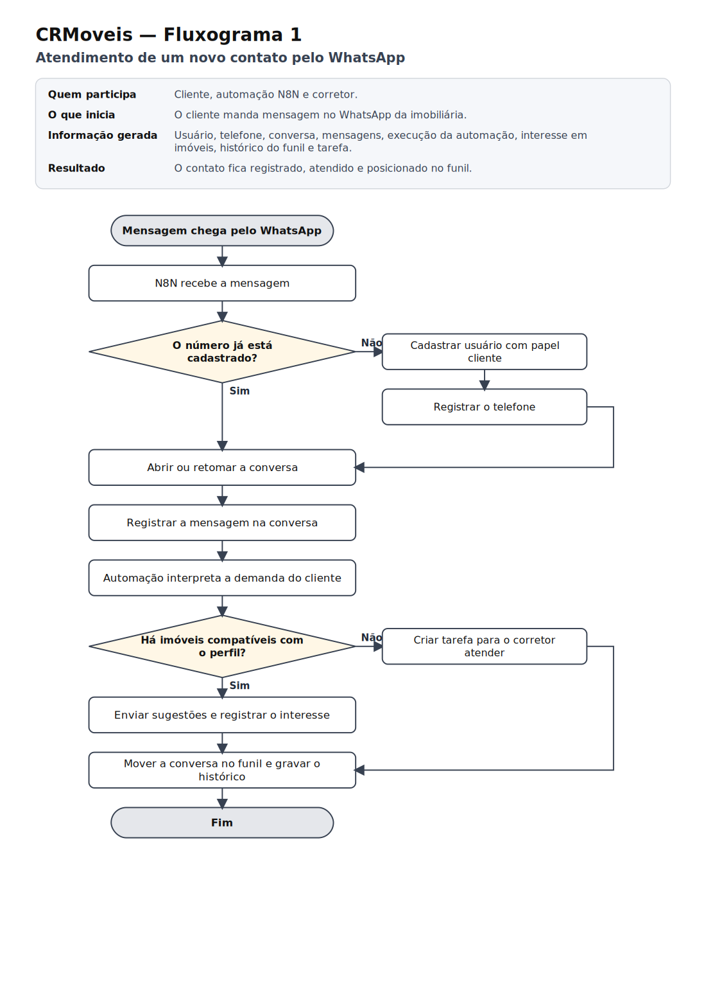

### F2 — Captação de imóvel


### F3 — Visita e proposta

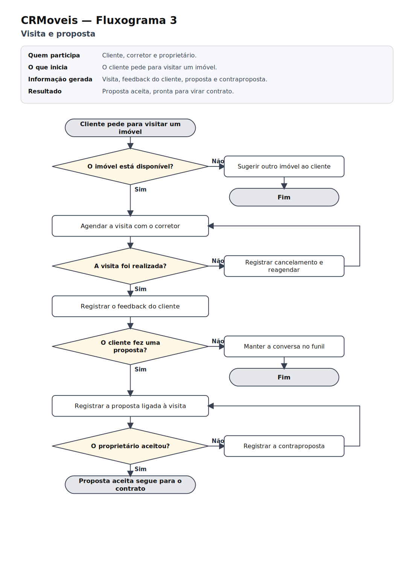

### F4 — Venda: contrato, financiamento e comissão

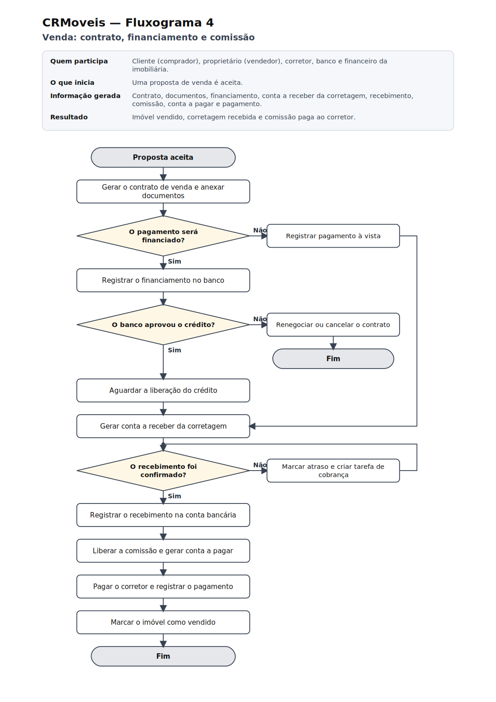

### F5 — Locação: ciclo mensal do aluguel

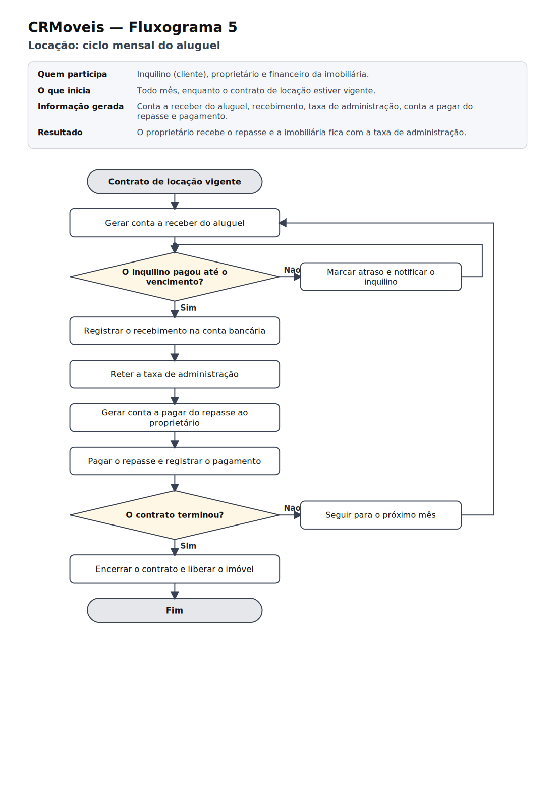

## 11. Entidades

O modelo tem **27 entidades**. Cada uma existe porque um requisito ou regra precisa dela.

| Entidade | Tipo | Por que existe | Requisito · regra | Folha do DER |
|---|---|---|---|---|
| **USUARIO** | forte | Toda pessoa que circula no CRM: cliente, proprietário, corretor, financeiro, fornecedor e administrador. Uma entidade só evita cadastro duplicado. | RF01, RF02 · RN01, RN02 | 2 |
| **TELEFONE** | fraca | A pessoa pode ter vários telefones, e é pelo número do WhatsApp que o sistema a identifica. Só existe ligado a um usuário. | RF03 · RN03 | 2 |
| **PERFIL_INTERESSE** | fraca | Guarda o que o cliente procura, para a automação sugerir imóveis. Só existe ligado a um usuário. | RF04, RF11 · RN05 | 2 |
| **IMOVEL** | forte | O produto da imobiliária, com endereço, características, valor e situação. | RF13, RF14 · RN06, RN10 | 2 |
| **FOTO** | fraca | Galeria do imóvel; a foto não tem sentido fora dele. | RF15 · RN09 | 2 |
| **CARACTERISTICA** | forte | Catálogo de itens (piscina, elevador, aceita pet) que permite filtrar imóveis sem depender de texto livre. | RF13 · RN08 | 2 |
| **CONVERSA_IMOVEL** | associativa | Registra quais imóveis interessam em cada conversa e desde quando. | RF17 | 2 |
| **CONVERSA** | forte | O atendimento de um cliente, que concentra as mensagens e a posição no funil. | RF05, RF06 · RN11, RN12 | 3 |
| **MENSAGEM** | fraca | Cada mensagem trocada ou nota interna; só existe dentro de uma conversa. | RF05 | 3 |
| **FUNIL_ESTAGIO** | forte | As etapas do funil de vendas (novo contato, visita, proposta, fechado). | RF07 · RN13 | 3 |
| **HISTORICO_ESTAGIO** | associativa | Cada passagem de uma conversa por um estágio, com data e hora; base do relatório de conversão. | RF08, RF30 · RN14 | 3 |
| **TAREFA** | forte | Pendências do corretor, com prazo, ligadas ou não a uma conversa. | RF10 · RN15 | 3 |
| **TAG** | forte | Etiquetas livres para classificar conversas. | RF09 | 3 |
| **VISITA** | associativa | O fato de um cliente visitar um imóvel com um corretor, com data, situação e feedback. | RF18 · RN16 | 4 |
| **PROPOSTA** | associativa | A oferta de um cliente por um imóvel, com valor, condições, situação e a autorização quando há desconto alto. | RF19 · RN17 · PO03 | 4 |
| **CONTRATO** | forte | O negócio fechado, de venda ou de locação, com os percentuais que definem a corretagem e o repasse. Dispara toda a parte financeira. | RF20 · RN18, RN19, RN30 · PO04 | 4 |
| **DOCUMENTO** | fraca | Arquivos do contrato (escritura, vistoria, documentos pessoais). | RF21 | 4 |
| **COMISSAO** | associativa | A parte de cada corretor em um contrato, com percentual, regra de pagamento e data de aprovação. | RF22, RF28 · RN20, RN21, RN24 · PO01 | 4 |
| **FINANCIAMENTO** | fraca | Os dados do crédito bancário de um contrato, principalmente a data de liberação, que define quando a corretagem cai. | RF23 · RN22, RN23 | 5 |
| **CONTA_RECEBER** | forte | Tudo o que a imobiliária tem a receber, com quem paga e o vencimento. | RF24 · RN26, RN27 | 5 |
| **RECEBIMENTO** | fraca | Cada baixa de uma conta a receber; permite recebimento parcial. | RF26 · RN29 | 5 |
| **CATEGORIA_FINANCEIRA** | forte | Classifica receitas e despesas para os relatórios financeiros. | RF29, RF31 · RN26 | 5 |
| **CONTA_BANCARIA** | forte | Onde o dinheiro entra e sai: contas e caixa da imobiliária. | RF26 · RN29 | 5 |
| **CONTA_PAGAR** | forte | Tudo o que a imobiliária tem a pagar: comissões, repasses, despesas e impostos, com quem paga e quem recebe. | RF25, RF27 · RN25, RN28 | 6 |
| **PAGAMENTO** | fraca | Cada baixa de uma conta a pagar; permite pagamento parcial. | RF26 · RN29 | 6 |
| **AUTOMACAO_EXECUCAO** | fraca | Cada vez que o N8N processa uma demanda de uma conversa; garante que a mesma demanda não seja processada duas vezes. | RF11 · RN31 | 6 |
| **AUTOMACAO_LOG** | fraca | Eventos técnicos de cada execução, para rastrear falhas da integração. | RF12 | 6 |

**Tipos (aula 6):** *forte* tem identificação própria; *fraca* depende da identificação de outra entidade e usa um identificador parcial; *associativa* nasce de um relacionamento N:N e guarda informações da própria relação.

## 12. Atributos

A lista completa, com descrição e regra de cada atributo, está no [dicionário de dados](#15-dicionário-de-dados-conceitual). Aqui ficam as classificações.

| Classificação | Atributos |
|---|---|
| **Identificador** | USUARIO.id_usuario, IMOVEL.id_imovel, CARACTERISTICA.id_caracteristica, CONVERSA.id_conversa, MENSAGEM.id_mensagem, FUNIL_ESTAGIO.id_estagio, TAREFA.id_tarefa, TAG.id_tag, VISITA.id_visita, PROPOSTA.id_proposta, CONTRATO.id_contrato, CATEGORIA_FINANCEIRA.id_categoria, CONTA_BANCARIA.id_conta, CONTA_RECEBER.id_conta_receber, CONTA_PAGAR.id_conta_pagar |
| **Identificador parcial (entidade fraca)** | TELEFONE.nr_telefone, PERFIL_INTERESSE.nr_perfil, FOTO.ordem, HISTORICO_ESTAGIO.dt_alteracao, DOCUMENTO.nr_documento, RECEBIMENTO.nr_recebimento, PAGAMENTO.nr_pagamento, AUTOMACAO_EXECUCAO.nr_execucao, AUTOMACAO_LOG.nr_log |
| **Composto** | IMOVEL.endereco (logradouro, numero, complemento, bairro, cidade, uf, cep) |
| **Multivalorado** | USUARIO.papel (cliente, proprietário, corretor, fornecedor, administrador) |
| **Derivado** | COMISSAO.valor (percentual × valor final do contrato) |
| **Simples** | Todos os demais |

### Atributos de relacionamento

Informações que descrevem a relação, e não uma das entidades (Etapa 15 do manual).

| Relacionamento | Atributos | Por que pertencem à relação |
|---|---|---|
| CONVERSA_IMOVEL | dt_interesse | A data de interesse descreve o vínculo entre aquela conversa e aquele imóvel |
| HISTORICO_ESTAGIO | dt_alteracao | A data e hora descrevem a passagem da conversa por um estágio |
| VISITA | id_visita, dt_hora, st_visita, feedback | Data, situação e feedback descrevem o encontro entre cliente e imóvel |
| PROPOSTA | id_proposta, vl_proposto, condicoes, st_proposta, dt_proposta, dt_autorizacao | Valor, condições e situação descrevem a oferta daquele cliente por aquele imóvel |
| COMISSAO | percentual, valor, regra_pagamento, st_pagamento, dt_aprovacao | Percentual e regra de pagamento descrevem a participação do corretor naquele contrato |
| AUTORIZA (USUARIO–PROPOSTA) | dt_autorizacao | Descreve a autorização do administrador. Como o relacionamento é 1:N, o atributo fica guardado em PROPOSTA |
| APROVA (USUARIO–COMISSAO) | dt_aprovacao | Descreve a aprovação do administrador. Como o relacionamento é 1:N, o atributo fica guardado em COMISSAO |

## 13. Relacionamentos

São **42 relacionamentos**, contando os que foram representados por entidade associativa.

| Relacionamento | Entre | Significado | Requisito · regra |
|---|---|---|---|
| **POSSUI** | USUARIO — TELEFONE | Um usuário possui telefones | RN03 |
| **BUSCA** | USUARIO — PERFIL_INTERESSE | Um usuário busca imóveis com determinado perfil | RN05 |
| **ANUNCIA** | USUARIO (proprietário) — IMOVEL | O proprietário anuncia o imóvel | RN06 |
| **RESPONSÁVEL** | USUARIO (corretor) — IMOVEL | O corretor é responsável pelo imóvel | RN07 |
| **TEM** | IMOVEL — FOTO | O imóvel tem fotos | RN09 |
| **APRESENTA** | IMOVEL — CARACTERISTICA | O imóvel possui características | RN08 |
| **INTERESSA (associativa CONVERSA_IMOVEL)** | IMOVEL — CONVERSA | A conversa se interessa por imóveis | RF17 |
| **INICIA** | USUARIO (cliente) — CONVERSA | O cliente inicia a conversa | RN11 |
| **ATENDE** | USUARIO (corretor) — CONVERSA | O corretor atende a conversa | RN12 |
| **CONTÉM** | CONVERSA — MENSAGEM | A conversa contém mensagens | RF05 |
| **MARCA** | CONVERSA — TAG | A conversa é marcada com tags | RF09 |
| **GERA TAREFA** | CONVERSA — TAREFA | A conversa gera tarefas | RN15 |
| **EXECUTA** | USUARIO (corretor) — TAREFA | O corretor executa a tarefa | RN15 |
| **ESTÁ EM** | CONVERSA — FUNIL_ESTAGIO | A conversa está em um estágio do funil | RN13 |
| **REGISTRA** | HISTORICO_ESTAGIO — USUARIO (responsável) | O usuário registra a mudança de estágio | RF08 |
| **MOVE (associativa HISTORICO_ESTAGIO)** | CONVERSA — FUNIL_ESTAGIO | A conversa passa pelos estágios do funil | RN14 |
| **ACOMPANHA** | VISITA — USUARIO (corretor) | O corretor acompanha a visita | RN16 |
| **ORIGINA** | VISITA — PROPOSTA | A visita dá origem à proposta | RN17 |
| **NEGOCIA** | PROPOSTA — USUARIO (corretor) | O corretor negocia a proposta | RF19 |
| **FECHA** | PROPOSTA — CONTRATO | A proposta aceita fecha o contrato | RN18 |
| **ANEXA** | CONTRATO — DOCUMENTO | O contrato tem documentos anexados | RF21 |
| **AUTORIZA** | PROPOSTA — USUARIO (administrador) | O administrador autoriza a proposta com desconto acima do limite | PO03 |
| **APROVA** | COMISSAO — USUARIO (administrador) | O administrador aprova a comissão antes do pagamento | PO01 |
| **VISITA (associativa VISITA)** | USUARIO (cliente) — IMOVEL | O cliente visita o imóvel | RN16 |
| **PROPOE (associativa PROPOSTA)** | USUARIO (cliente) — IMOVEL | O cliente faz proposta pelo imóvel | RF19 |
| **RECEBE (associativa COMISSAO)** | CONTRATO — USUARIO (corretor) | O corretor recebe comissão do contrato | RN20 |
| **FINANCIA** | CONTRATO — FINANCIAMENTO | O contrato é financiado | RN22 |
| **GERA RECEITA** | CONTRATO — CONTA_RECEBER | O contrato gera contas a receber | RF24 |
| **LIBERA** | FINANCIAMENTO — CONTA_RECEBER | A liberação do crédito gera a conta a receber da corretagem | RN23 |
| **CLASSIFICA** | CATEGORIA_FINANCEIRA — CONTA_RECEBER | A categoria classifica a conta a receber | RN26 |
| **PAGA** | USUARIO (pagador) — CONTA_RECEBER | A pessoa paga a conta a receber | RN27 |
| **QUITA** | CONTA_RECEBER — RECEBIMENTO | A conta a receber é baixada por recebimentos | RN29 |
| **CREDITA** | CONTA_BANCARIA — RECEBIMENTO | O recebimento entra em uma conta bancária | RN29 |
| **GERA DESPESA** | CONTRATO — CONTA_PAGAR | O contrato origina contas a pagar | RF25 |
| **CATEGORIZA** | CATEGORIA_FINANCEIRA — CONTA_PAGAR | A categoria classifica a conta a pagar | RN26 |
| **FAVORECE** | USUARIO (favorecido) — CONTA_PAGAR | A conta a pagar favorece uma pessoa | RF25 |
| **CUSTEIA** | USUARIO (pagador) — CONTA_PAGAR | A pessoa paga a conta a pagar | RN28 |
| **LANÇA** | COMISSAO — CONTA_PAGAR | A comissão liberada lança a conta a pagar ao corretor | RN25 |
| **LIQUIDA** | CONTA_PAGAR — PAGAMENTO | A conta a pagar é baixada por pagamentos | RN29 |
| **DEBITA** | CONTA_BANCARIA — PAGAMENTO | O pagamento sai de uma conta bancária | RN29 |
| **DISPARA** | CONVERSA — AUTOMACAO_EXECUCAO | A conversa dispara execuções da automação | RN31 |
| **GRAVA** | AUTOMACAO_EXECUCAO — AUTOMACAO_LOG | A execução registra eventos (logs) | RF12 |

## 14. Cardinalidades

Cada cardinalidade foi definida pelo método **vá e volte** do manual: partindo de uma ocorrência de cada lado e perguntando quantas ocorrências do outro lado ela pode ter.

**Leitura no DER:** a cardinalidade escrita junto de uma entidade indica quantas ocorrências *dessa* entidade se ligam a uma ocorrência da outra ponta. Exemplo: em `USUARIO (1,1) — POSSUI — (0,n) TELEFONE`, um usuário tem nenhum ou vários telefones, e cada telefone pertence a exatamente um usuário.

| Relacionamento | Ida | Volta | Como fica no DER | Regra |
|---|---|---|---|---|
| POSSUI | 1 USUARIO → nenhum ou vários TELEFONE | 1 TELEFONE → exatamente um USUARIO | USUARIO (1,1) — POSSUI — (0,n) TELEFONE | RN03 |
| BUSCA | 1 USUARIO → nenhum ou vários PERFIL_INTERESSE | 1 PERFIL_INTERESSE → exatamente um USUARIO | USUARIO (1,1) — BUSCA — (0,n) PERFIL_INTERESSE | RN05 |
| ANUNCIA | 1 USUARIO (proprietário) → nenhum ou vários IMOVEL | 1 IMOVEL → exatamente um USUARIO (proprietário) | USUARIO (proprietário) (1,1) — ANUNCIA — (0,n) IMOVEL | RN06 |
| RESPONSÁVEL | 1 USUARIO (corretor) → nenhum ou vários IMOVEL | 1 IMOVEL → nenhum ou um USUARIO (corretor) | USUARIO (corretor) (0,1) — RESPONSÁVEL — (0,n) IMOVEL | RN07 |
| TEM | 1 IMOVEL → nenhum ou vários FOTO | 1 FOTO → exatamente um IMOVEL | IMOVEL (1,1) — TEM — (0,n) FOTO | RN09 |
| APRESENTA | 1 IMOVEL → nenhum ou vários CARACTERISTICA | 1 CARACTERISTICA → nenhum ou vários IMOVEL | IMOVEL (0,n) — APRESENTA — (0,n) CARACTERISTICA | RN08 |
| INTERESSA | 1 IMOVEL → nenhum ou vários CONVERSA | 1 CONVERSA → nenhum ou vários IMOVEL | IMOVEL (0,n) — INTERESSA — (0,n) CONVERSA · N:N | RF17 |
| INICIA | 1 USUARIO (cliente) → nenhum ou vários CONVERSA | 1 CONVERSA → exatamente um USUARIO (cliente) | USUARIO (cliente) (1,1) — INICIA — (0,n) CONVERSA | RN11 |
| ATENDE | 1 USUARIO (corretor) → nenhum ou vários CONVERSA | 1 CONVERSA → nenhum ou um USUARIO (corretor) | USUARIO (corretor) (0,1) — ATENDE — (0,n) CONVERSA | RN12 |
| CONTÉM | 1 CONVERSA → nenhum ou vários MENSAGEM | 1 MENSAGEM → exatamente um CONVERSA | CONVERSA (1,1) — CONTÉM — (0,n) MENSAGEM | RF05 |
| MARCA | 1 CONVERSA → nenhum ou vários TAG | 1 TAG → nenhum ou vários CONVERSA | CONVERSA (0,n) — MARCA — (0,n) TAG | RF09 |
| GERA TAREFA | 1 CONVERSA → nenhum ou vários TAREFA | 1 TAREFA → nenhum ou um CONVERSA | CONVERSA (0,1) — GERA TAREFA — (0,n) TAREFA | RN15 |
| EXECUTA | 1 USUARIO (corretor) → nenhum ou vários TAREFA | 1 TAREFA → exatamente um USUARIO (corretor) | USUARIO (corretor) (1,1) — EXECUTA — (0,n) TAREFA | RN15 |
| ESTÁ EM | 1 CONVERSA → exatamente um FUNIL_ESTAGIO | 1 FUNIL_ESTAGIO → nenhum ou vários CONVERSA | CONVERSA (0,n) — ESTÁ EM — (1,1) FUNIL_ESTAGIO | RN13 |
| REGISTRA | 1 HISTORICO_ESTAGIO → nenhum ou um USUARIO (responsável) | 1 USUARIO (responsável) → nenhum ou vários HISTORICO_ESTAGIO | HISTORICO_ESTAGIO (0,n) — REGISTRA — (0,1) USUARIO (responsável) | RF08 |
| MOVE | 1 CONVERSA → nenhum ou vários FUNIL_ESTAGIO | 1 FUNIL_ESTAGIO → nenhum ou vários CONVERSA | CONVERSA (0,n) — MOVE — (0,n) FUNIL_ESTAGIO · N:N | RN14 |
| ACOMPANHA | 1 VISITA → exatamente um USUARIO (corretor) | 1 USUARIO (corretor) → nenhum ou vários VISITA | VISITA (0,n) — ACOMPANHA — (1,1) USUARIO (corretor) | RN16 |
| ORIGINA | 1 VISITA → nenhum ou vários PROPOSTA | 1 PROPOSTA → nenhum ou um VISITA | VISITA (0,1) — ORIGINA — (0,n) PROPOSTA | RN17 |
| NEGOCIA | 1 PROPOSTA → exatamente um USUARIO (corretor) | 1 USUARIO (corretor) → nenhum ou vários PROPOSTA | PROPOSTA (0,n) — NEGOCIA — (1,1) USUARIO (corretor) | RF19 |
| FECHA | 1 PROPOSTA → nenhum ou um CONTRATO | 1 CONTRATO → exatamente um PROPOSTA | PROPOSTA (1,1) — FECHA — (0,1) CONTRATO | RN18 |
| ANEXA | 1 CONTRATO → nenhum ou vários DOCUMENTO | 1 DOCUMENTO → exatamente um CONTRATO | CONTRATO (1,1) — ANEXA — (0,n) DOCUMENTO | RF21 |
| AUTORIZA | 1 PROPOSTA → nenhum ou um USUARIO (administrador) | 1 USUARIO (administrador) → nenhum ou vários PROPOSTA | PROPOSTA (0,n) — AUTORIZA — (0,1) USUARIO (administrador) | PO03 |
| APROVA | 1 COMISSAO → nenhum ou um USUARIO (administrador) | 1 USUARIO (administrador) → nenhum ou vários COMISSAO | COMISSAO (0,n) — APROVA — (0,1) USUARIO (administrador) | PO01 |
| VISITA | 1 USUARIO (cliente) → nenhum ou vários IMOVEL | 1 IMOVEL → nenhum ou vários USUARIO (cliente) | USUARIO (cliente) (0,n) — VISITA — (0,n) IMOVEL · N:N | RN16 |
| PROPOE | 1 USUARIO (cliente) → nenhum ou vários IMOVEL | 1 IMOVEL → nenhum ou vários USUARIO (cliente) | USUARIO (cliente) (0,n) — PROPOE — (0,n) IMOVEL · N:N | RF19 |
| RECEBE | 1 CONTRATO → nenhum ou vários USUARIO (corretor) | 1 USUARIO (corretor) → nenhum ou vários CONTRATO | CONTRATO (0,n) — RECEBE — (0,n) USUARIO (corretor) · N:N | RN20 |
| FINANCIA | 1 CONTRATO → nenhum ou um FINANCIAMENTO | 1 FINANCIAMENTO → exatamente um CONTRATO | CONTRATO (1,1) — FINANCIA — (0,1) FINANCIAMENTO | RN22 |
| GERA RECEITA | 1 CONTRATO → nenhum ou vários CONTA_RECEBER | 1 CONTA_RECEBER → nenhum ou um CONTRATO | CONTRATO (0,1) — GERA RECEITA — (0,n) CONTA_RECEBER | RF24 |
| LIBERA | 1 FINANCIAMENTO → nenhum ou vários CONTA_RECEBER | 1 CONTA_RECEBER → nenhum ou um FINANCIAMENTO | FINANCIAMENTO (0,1) — LIBERA — (0,n) CONTA_RECEBER | RN23 |
| CLASSIFICA | 1 CATEGORIA_FINANCEIRA → nenhum ou vários CONTA_RECEBER | 1 CONTA_RECEBER → exatamente um CATEGORIA_FINANCEIRA | CATEGORIA_FINANCEIRA (1,1) — CLASSIFICA — (0,n) CONTA_RECEBER | RN26 |
| PAGA | 1 USUARIO (pagador) → nenhum ou vários CONTA_RECEBER | 1 CONTA_RECEBER → nenhum ou um USUARIO (pagador) | USUARIO (pagador) (0,1) — PAGA — (0,n) CONTA_RECEBER | RN27 |
| QUITA | 1 CONTA_RECEBER → nenhum ou vários RECEBIMENTO | 1 RECEBIMENTO → exatamente um CONTA_RECEBER | CONTA_RECEBER (1,1) — QUITA — (0,n) RECEBIMENTO | RN29 |
| CREDITA | 1 CONTA_BANCARIA → nenhum ou vários RECEBIMENTO | 1 RECEBIMENTO → exatamente um CONTA_BANCARIA | CONTA_BANCARIA (1,1) — CREDITA — (0,n) RECEBIMENTO | RN29 |
| GERA DESPESA | 1 CONTRATO → nenhum ou vários CONTA_PAGAR | 1 CONTA_PAGAR → nenhum ou um CONTRATO | CONTRATO (0,1) — GERA DESPESA — (0,n) CONTA_PAGAR | RF25 |
| CATEGORIZA | 1 CATEGORIA_FINANCEIRA → nenhum ou vários CONTA_PAGAR | 1 CONTA_PAGAR → exatamente um CATEGORIA_FINANCEIRA | CATEGORIA_FINANCEIRA (1,1) — CATEGORIZA — (0,n) CONTA_PAGAR | RN26 |
| FAVORECE | 1 USUARIO (favorecido) → nenhum ou vários CONTA_PAGAR | 1 CONTA_PAGAR → nenhum ou um USUARIO (favorecido) | USUARIO (favorecido) (0,1) — FAVORECE — (0,n) CONTA_PAGAR | RF25 |
| CUSTEIA | 1 USUARIO (pagador) → nenhum ou vários CONTA_PAGAR | 1 CONTA_PAGAR → nenhum ou um USUARIO (pagador) | USUARIO (pagador) (0,1) — CUSTEIA — (0,n) CONTA_PAGAR | RN28 |
| LANÇA | 1 COMISSAO → nenhum ou um CONTA_PAGAR | 1 CONTA_PAGAR → nenhum ou um COMISSAO | COMISSAO (0,1) — LANÇA — (0,1) CONTA_PAGAR | RN25 |
| LIQUIDA | 1 CONTA_PAGAR → nenhum ou vários PAGAMENTO | 1 PAGAMENTO → exatamente um CONTA_PAGAR | CONTA_PAGAR (1,1) — LIQUIDA — (0,n) PAGAMENTO | RN29 |
| DEBITA | 1 CONTA_BANCARIA → nenhum ou vários PAGAMENTO | 1 PAGAMENTO → exatamente um CONTA_BANCARIA | CONTA_BANCARIA (1,1) — DEBITA — (0,n) PAGAMENTO | RN29 |
| DISPARA | 1 CONVERSA → nenhum ou vários AUTOMACAO_EXECUCAO | 1 AUTOMACAO_EXECUCAO → exatamente um CONVERSA | CONVERSA (1,1) — DISPARA — (0,n) AUTOMACAO_EXECUCAO | RN31 |
| GRAVA | 1 AUTOMACAO_EXECUCAO → nenhum ou vários AUTOMACAO_LOG | 1 AUTOMACAO_LOG → exatamente um AUTOMACAO_EXECUCAO | AUTOMACAO_EXECUCAO (1,1) — GRAVA — (0,n) AUTOMACAO_LOG | RF12 |

**Relacionamentos N:N verificados (Etapa 14):** imóvel × característica e conversa × tag ficaram como losango, porque não têm informação própria; conversa × imóvel, conversa × estágio, cliente × imóvel (visita e proposta) e contrato × corretor viraram entidades associativas, porque têm.

## 15. Dicionário de dados conceitual

Preliminar, no formato do manual: identificar, descrever e organizar. Tipos de dados e implementação física ficam para o modelo lógico.

### USUARIO · forte

| Atributo | Descrição | Regra / observação |
|---|---|---|
| id_usuario | Identificador do usuário | Identificação única |
| nome | Nome completo ou razão social | Obrigatório |
| documento | CPF ou CNPJ | Não pode se repetir; obrigatório para proprietário e para quem assina contrato (RN04) |
| email | E-mail de contato e de acesso | Não pode se repetir; obrigatório para quem acessa o sistema |
| senha | Senha de acesso ao sistema | Só para quem acessa o sistema; armazenada de forma protegida (RNF02) |
| creci | Registro do corretor no CRECI | Obrigatório para quem tem o papel corretor |
| origem | Canal pelo qual a pessoa chegou | Site, indicação, portal, Instagram, WhatsApp ou interno |
| papel | Papéis que a pessoa exerce | Multivalorado: cliente, proprietário, corretor, financeiro, fornecedor, administrador; pelo menos um (RN01, RN02) |
| ativo | Indica se o cadastro está ativo | Cadastro inativo não acessa o sistema |
| dt_cadastro | Data do cadastro | Preenchida automaticamente |

### TELEFONE · fraca

| Atributo | Descrição | Regra / observação |
|---|---|---|
| nr_telefone | Número sequencial do telefone dentro do usuário | Identificador parcial |
| numero | Número com DDD | Obrigatório; não pode se repetir no sistema (RN03) |
| tipo | Tipo da linha | Celular, WhatsApp ou fixo |
| principal | Indica o telefone preferencial | Apenas um principal por usuário |

### PERFIL_INTERESSE · fraca

| Atributo | Descrição | Regra / observação |
|---|---|---|
| nr_perfil | Número do perfil dentro do usuário | Identificador parcial |
| finalidade | Compra ou locação | Obrigatório |
| tipo_imovel | Tipo de imóvel procurado | Ex.: apartamento, casa, comercial |
| cidade | Cidade desejada | — |
| bairro | Bairro desejado | Pode ficar em branco |
| vl_minimo | Valor mínimo aceito | Não pode ser maior que o valor máximo |
| vl_maximo | Valor máximo aceito | Maior ou igual ao mínimo |
| quartos_min | Quantidade mínima de quartos | — |

### IMOVEL · forte

| Atributo | Descrição | Regra / observação |
|---|---|---|
| id_imovel | Identificador do imóvel | Identificação única |
| cd_imobizi | Código do imóvel no IMOBIZI | Não pode se repetir; usado na importação (RF14) |
| tipo_imovel | Tipo do imóvel | Apartamento, casa, terreno, comercial ou rural |
| finalidade | Venda ou locação | Obrigatório |
| endereco | Endereço do imóvel | Composto por logradouro, número, complemento, bairro, cidade, UF e CEP |
| area_util | Área útil em m² | — |
| area_total | Área total em m² | Maior ou igual à área útil |
| quartos | Quantidade de quartos | — |
| banheiros | Quantidade de banheiros | — |
| vagas_garagem | Quantidade de vagas de garagem | — |
| valor | Preço de venda ou aluguel mensal | Conforme a finalidade |
| st_imovel | Situação do imóvel | Disponível, reservado, vendido, alugado ou inativo; vendido, alugado ou inativo não recebe visita nem proposta (RN10) |
| descricao | Texto do anúncio | — |
| dt_cadastro | Data do cadastro | Preenchida automaticamente |

### FOTO · fraca

| Atributo | Descrição | Regra / observação |
|---|---|---|
| ordem | Posição da foto na galeria | Identificador parcial |
| url | Endereço do arquivo da foto | Obrigatório |

### CARACTERISTICA · forte

| Atributo | Descrição | Regra / observação |
|---|---|---|
| id_caracteristica | Identificador da característica | Identificação única |
| nm_caracteristica | Nome (piscina, elevador, aceita pet…) | Não pode se repetir |

### CONVERSA_IMOVEL · associativa

| Atributo | Descrição | Regra / observação |
|---|---|---|
| dt_interesse | Quando o imóvel passou a interessar na conversa | Atributo do relacionamento |

### CONVERSA · forte

| Atributo | Descrição | Regra / observação |
|---|---|---|
| id_conversa | Identificador da conversa | Identificação única |
| notas | Anotações do corretor sobre o atendimento | — |
| dt_inicio | Data de abertura da conversa | Preenchida automaticamente |
| dt_atualizacao | Data da última movimentação | Atualizada a cada mensagem |

### MENSAGEM · fraca

| Atributo | Descrição | Regra / observação |
|---|---|---|
| id_mensagem | Identificador da mensagem | Identificação única |
| direcao | Entrada (cliente) ou saída (imobiliária) | Em branco quando for nota interna |
| canal | Meio da mensagem | WhatsApp, e-mail ou nota interna |
| corpo | Conteúdo da mensagem | Obrigatório |
| dt_mensagem | Data e hora da mensagem | Obrigatória |

### FUNIL_ESTAGIO · forte

| Atributo | Descrição | Regra / observação |
|---|---|---|
| id_estagio | Identificador do estágio | Identificação única |
| nm_estagio | Nome do estágio | Não pode se repetir |
| ordem | Posição do estágio no funil | Obrigatória |
| cor | Cor usada no quadro do funil | — |

### HISTORICO_ESTAGIO · associativa

| Atributo | Descrição | Regra / observação |
|---|---|---|
| dt_alteracao | Data e hora da mudança de estágio | Identificador parcial; toda mudança gera um registro (RN14) |

### TAREFA · forte

| Atributo | Descrição | Regra / observação |
|---|---|---|
| id_tarefa | Identificador da tarefa | Identificação única |
| titulo | Resumo da tarefa | Obrigatório |
| descricao | Detalhes | — |
| dt_vencimento | Prazo da tarefa | A situação “atrasada” é calculada a partir do prazo |
| st_tarefa | Situação | Pendente, concluída ou cancelada |

### TAG · forte

| Atributo | Descrição | Regra / observação |
|---|---|---|
| id_tag | Identificador da tag | Identificação única |
| nm_tag | Texto da etiqueta | Não pode se repetir |

### VISITA · associativa

| Atributo | Descrição | Regra / observação |
|---|---|---|
| id_visita | Identificador da visita | Identificação única |
| dt_hora | Data e hora da visita | Obrigatória; o mesmo cliente não visita o mesmo imóvel duas vezes no mesmo horário (RN16) |
| st_visita | Situação | Agendada, realizada ou cancelada |
| feedback | Impressão do cliente após a visita | Preenchido quando a visita é realizada |

### PROPOSTA · associativa

| Atributo | Descrição | Regra / observação |
|---|---|---|
| id_proposta | Identificador da proposta | Identificação única |
| vl_proposto | Valor oferecido | Obrigatório; desconto acima de 10% exige aprovação (PO03) |
| condicoes | Forma de pagamento, prazos e financiamento | — |
| st_proposta | Situação | Pendente, aceita, recusada ou contraproposta |
| dt_proposta | Data da proposta | Obrigatória |
| dt_autorizacao | Data da autorização do administrador | Obrigatória quando o desconto passa de 10% (PO03); atributo do relacionamento AUTORIZA |

### CONTRATO · forte

| Atributo | Descrição | Regra / observação |
|---|---|---|
| id_contrato | Identificador do contrato | Identificação única |
| tipo_contrato | Venda ou locação | Obrigatório (RN19) |
| forma_pagamento | Como o comprador paga | À vista, financiado ou parcelado direto |
| vl_final | Valor fechado; na locação, o aluguel mensal | Obrigatório |
| percentual_corretagem | Percentual de corretagem da venda | Obrigatório na venda; base da conta a receber da corretagem (RF24) |
| taxa_administracao | Percentual retido do aluguel pela imobiliária | Obrigatório na locação; define o repasse ao proprietário (RN30) |
| dia_vencimento | Dia do mês em que vence o aluguel | Obrigatório na locação (RF27) |
| dt_assinatura | Data da assinatura | — |
| dt_fim | Data de término | Obrigatória na locação (RN19) |
| st_contrato | Situação | Vigente, encerrado ou cancelado; contrato assinado não é excluído, só cancelado (PO04) |
| dt_cancelamento | Data do cancelamento | Obrigatória quando cancelado (PO04) |
| motivo_cancelamento | Motivo do cancelamento | Obrigatório quando cancelado (PO04) |

### DOCUMENTO · fraca

| Atributo | Descrição | Regra / observação |
|---|---|---|
| nr_documento | Número do documento dentro do contrato | Identificador parcial |
| nm_documento | Nome do documento | — |
| url | Endereço do arquivo | Obrigatório |

### COMISSAO · associativa

| Atributo | Descrição | Regra / observação |
|---|---|---|
| percentual | Percentual do corretor sobre o valor do contrato | Obrigatório; a soma no contrato não passa de 100% (RN20) |
| valor | Valor da comissão | Derivado: percentual × valor final do contrato (RN21) |
| regra_pagamento | Quando a comissão pode ser paga | Na assinatura, na liberação do crédito ou no recebimento (RN24) |
| st_pagamento | Situação | Pendente, liberada, paga ou cancelada |
| dt_aprovacao | Data da aprovação do administrador | Obrigatória antes do pagamento (PO01); atributo do relacionamento APROVA |

### FINANCIAMENTO · fraca

*Identificação: identificado pelo contrato (entidade fraca, relação 1:1).*

| Atributo | Descrição | Regra / observação |
|---|---|---|
| instituicao | Banco que concede o crédito | Obrigatório |
| vl_financiado | Valor financiado | Obrigatório |
| vl_entrada | Valor de entrada | — |
| nr_parcelas | Quantidade de parcelas | — |
| taxa_juros_aa | Taxa de juros ao ano | — |
| st_financiamento | Situação | Em análise, aprovado, reprovado, liberado ou cancelado |
| dt_aprovacao | Data da aprovação do crédito | — |
| dt_liberacao | Data em que o banco libera o crédito | Condiciona o recebimento da corretagem (RN23) |

### CONTA_RECEBER · forte

| Atributo | Descrição | Regra / observação |
|---|---|---|
| id_conta_receber | Identificador da conta a receber | Identificação única |
| responsavel | Quem paga | Cliente, inquilino, proprietário ou banco; obrigatório (RN27) |
| origem | Natureza da receita | Corretagem, intermediação, administração, aluguel ou serviço |
| descricao | Descrição | — |
| competencia | Mês de referência | Obrigatório na locação |
| valor | Valor a receber | Obrigatório |
| vencimento | Data de vencimento | Obrigatória |
| st_conta | Situação | Previsto, parcial, recebido, atrasado ou cancelado |

### RECEBIMENTO · fraca

| Atributo | Descrição | Regra / observação |
|---|---|---|
| nr_recebimento | Número do recebimento dentro da conta | Identificador parcial |
| dt_recebimento | Data do recebimento | Obrigatória |
| valor | Valor recebido | Obrigatório; a soma não passa do valor da conta |
| forma | Forma de pagamento | Pix, TED, boleto, dinheiro ou cartão |

### CATEGORIA_FINANCEIRA · forte

| Atributo | Descrição | Regra / observação |
|---|---|---|
| id_categoria | Identificador da categoria | Identificação única |
| nm_categoria | Nome da categoria | Não pode se repetir |
| tipo | Receita ou despesa | Obrigatório |

### CONTA_BANCARIA · forte

| Atributo | Descrição | Regra / observação |
|---|---|---|
| id_conta | Identificador da conta | Identificação única |
| apelido | Nome de referência da conta | Não pode se repetir |
| instituicao | Banco | — |
| tipo_conta | Tipo | Corrente, poupança ou caixa |
| ativa | Indica se a conta está em uso | — |

### CONTA_PAGAR · forte

| Atributo | Descrição | Regra / observação |
|---|---|---|
| id_conta_pagar | Identificador da conta a pagar | Identificação única |
| responsavel | Quem paga | Imobiliária, proprietário ou inquilino; obrigatório (RN28) |
| tipo_conta | Natureza da despesa | Comissão, repasse ao proprietário, despesa ou imposto |
| descricao | Descrição | — |
| competencia | Mês de referência | Obrigatório no repasse de aluguel |
| valor | Valor a pagar | Obrigatório |
| vencimento | Data de vencimento | No repasse, até 5 dias úteis após o recebimento do aluguel (PO05) |
| st_conta | Situação | Previsto, parcial, pago, atrasado ou cancelado |

### PAGAMENTO · fraca

| Atributo | Descrição | Regra / observação |
|---|---|---|
| nr_pagamento | Número do pagamento dentro da conta | Identificador parcial |
| dt_pagamento | Data do pagamento | Obrigatória |
| valor | Valor pago | Obrigatório; a soma não passa do valor da conta |
| forma | Forma de pagamento | Pix, TED, boleto, dinheiro ou cartão |

### AUTOMACAO_EXECUCAO · fraca

| Atributo | Descrição | Regra / observação |
|---|---|---|
| nr_execucao | Número da execução dentro da conversa | Identificador parcial |
| chave_demanda | Resumo que identifica a demanda | Não se repete na mesma conversa (RN31) |
| st_execucao | Situação da execução | — |
| demanda_interpretada | O que o cliente pediu, extraído da mensagem | — |
| criterios_selecao | Critérios usados para escolher os imóveis | — |
| conteudo_enviado | Conteúdo enviado ao cliente | — |
| mensagem | Resumo da execução | — |
| erro | Erro ocorrido, se houver | — |
| dt_execucao | Data e hora da execução | Obrigatória |
| dt_envio | Data e hora do envio ao cliente | — |

### AUTOMACAO_LOG · fraca

| Atributo | Descrição | Regra / observação |
|---|---|---|
| nr_log | Número do evento dentro da execução | Identificador parcial |
| evento | Nome do evento | Obrigatório |
| mensagem | Descrição do evento | — |
| dados_evento | Dados técnicos do evento | — |
| dt_log | Data e hora do evento | Obrigatória |

## 16. DER

Modelo conceitual em notação de Chen. O DER foi desenhado em seis folhas, uma por domínio, para que nenhuma linha cruze outra e a letra seja legível. Quando uma entidade detalhada em outra folha participa de um relacionamento, ela aparece como **atalho** (caixa tracejada com a folha indicada).

Arquivo para impressão (A3): [`docs/der/CRMoveis-DER-conceitual.pdf`](CRMoveis/docs/der/CRMoveis-DER-conceitual.pdf)

### Visão geral

Todas as folhas juntas, para ver a integração entre os domínios. Para leitura, use as folhas abaixo ou o PDF.

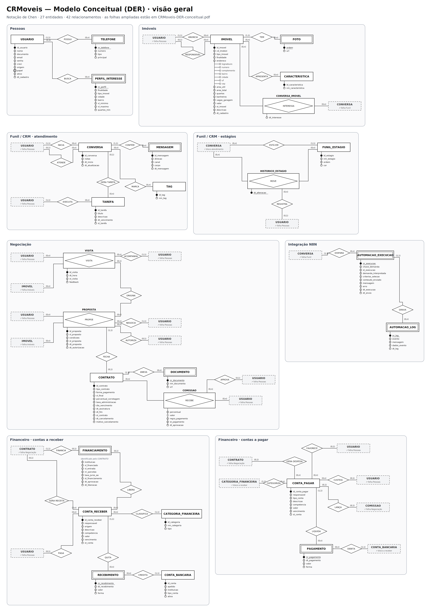

| Símbolo | Significado |
|---|---|
| Retângulo | Entidade forte |
| Retângulo duplo | Entidade fraca |
| Retângulo com losango | Entidade associativa |
| Losango | Relacionamento |
| Círculo preenchido | Identificador (sublinhado) ou identificador parcial (sublinhado tracejado) |
| Círculo vazio | Atributo simples |
| Círculo duplo | Atributo multivalorado |
| Círculo tracejado | Atributo derivado |
| Caixa cinza tracejada | Atalho para entidade de outra folha |

### Folha 1 — Identificação, legenda e índice das entidades

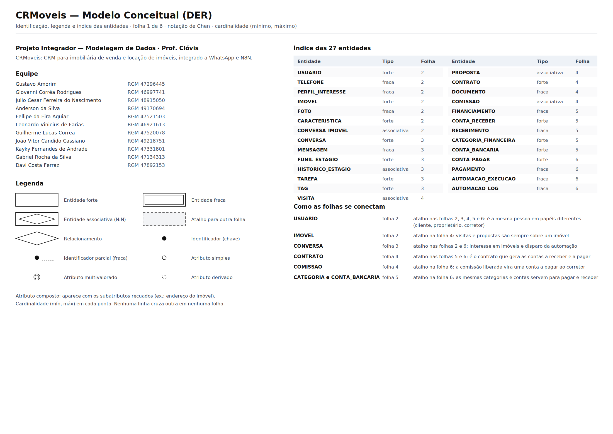

### Folha 2 — Pessoas e Imóveis

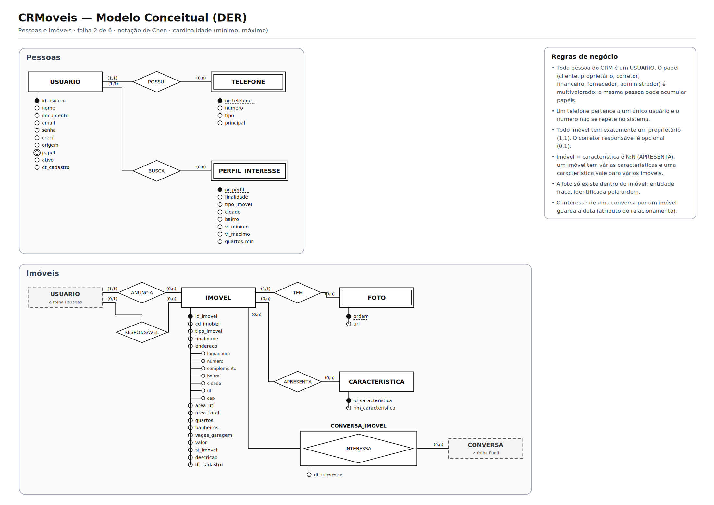

### Folha 3 — Funil / CRM

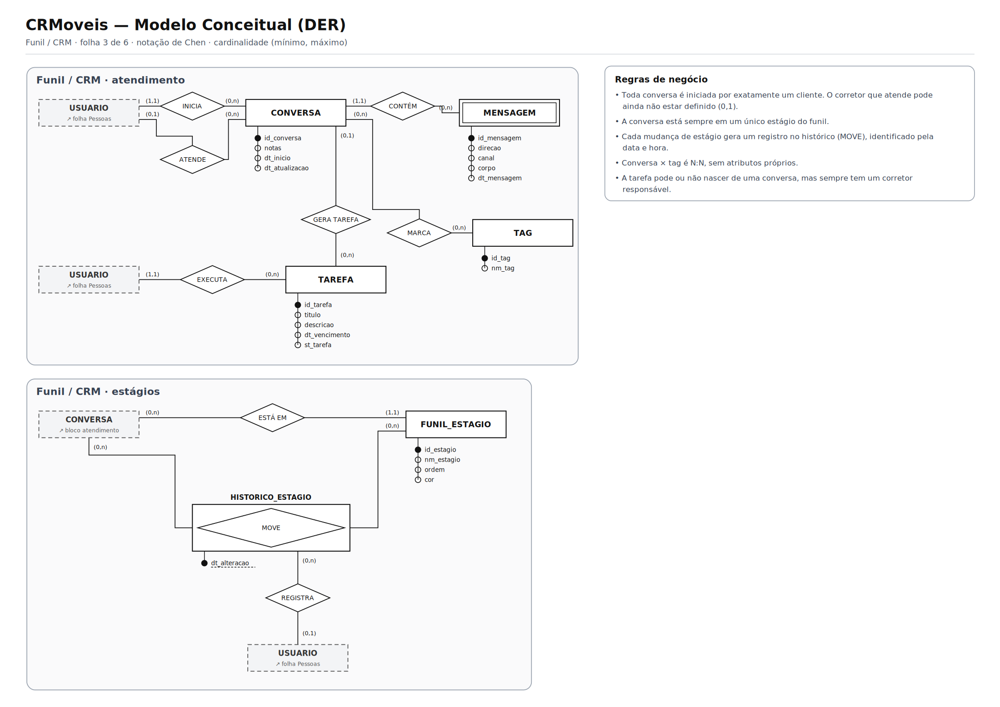

### Folha 4 — Negociação

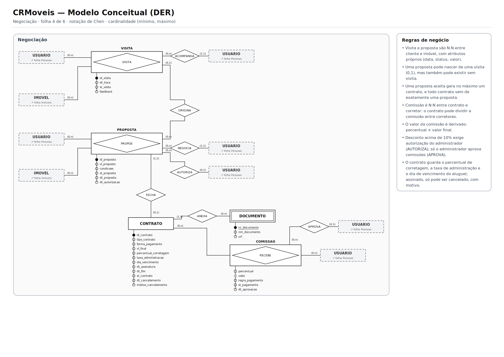

### Folha 5 — Financeiro · contas a receber

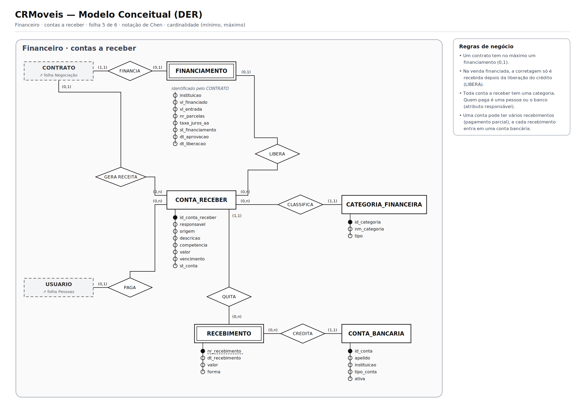

### Folha 6 — Financeiro · contas a pagar e Integração N8N

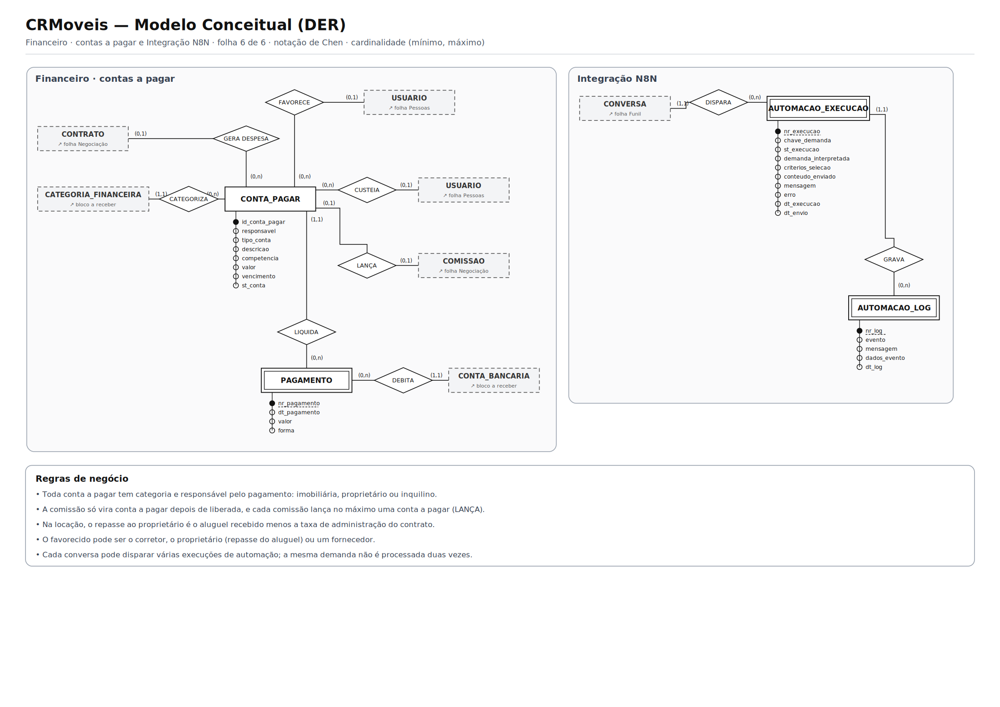

## 17. Justificativas técnicas

As principais decisões de modelagem, no formato pedido pelo manual.

### 17.1 Uma única entidade USUARIO para todas as pessoas

| | |
|---|---|
| **O que decidimos** | Cliente, proprietário, corretor, fornecedor e administrador são a mesma entidade, com o papel como atributo multivalorado. |
| **Por que decidimos assim** | A mesma pessoa pode ter vários papéis (o proprietário que também quer comprar), e separar em entidades duplicaria cadastro e telefone. |
| **Qual regra sustenta** | RN01, RN02 · problema “proprietário tratado como duas pessoas” |

### 17.2 TELEFONE como entidade fraca

| | |
|---|---|
| **O que decidimos** | O telefone saiu de USUARIO e virou entidade fraca, identificada pelo número sequencial dentro do usuário. |
| **Por que decidimos assim** | Telefone é multivalorado e tem atributos próprios (tipo, principal). É pelo número que a automação identifica o cliente. |
| **Qual regra sustenta** | RN03 · RF03 |

### 17.3 Endereço como atributo composto

| | |
|---|---|
| **O que decidimos** | O endereço do imóvel foi decomposto em logradouro, número, complemento, bairro, cidade, UF e CEP. |
| **Por que decidimos assim** | A busca por imóvel é feita por cidade e bairro, e o perfil de interesse compara esses campos separadamente. |
| **Qual regra sustenta** | RF04, RF11 |

### 17.4 Imóvel × característica como N:N sem atributos

| | |
|---|---|
| **O que decidimos** | Ficou como losango (0,n)–(0,n), sem entidade associativa. |
| **Por que decidimos assim** | Um imóvel tem várias características e uma característica vale para vários imóveis; a relação não guarda nenhuma informação própria. |
| **Qual regra sustenta** | RN08 · Etapas 14 e 15 do manual |

### 17.5 VISITA e PROPOSTA como associativas com identificador próprio

| | |
|---|---|
| **O que decidimos** | São N:N entre cliente e imóvel, com atributos (data, situação, valor) e identificador próprio. |
| **Por que decidimos assim** | O mesmo cliente pode visitar o mesmo imóvel mais de uma vez e fazer várias propostas, então o par cliente–imóvel não basta para identificar. |
| **Qual regra sustenta** | RN16, RN17 · aula 6 |

### 17.6 PROPOSTA (1,1) — FECHA — CONTRATO (0,1)

| | |
|---|---|
| **O que decidimos** | Uma proposta gera no máximo um contrato, e todo contrato nasce de exatamente uma proposta. |
| **Por que decidimos assim** | Nem toda proposta é aceita (0), e a aceita não pode gerar dois contratos (1); não existe contrato sem proposta. |
| **Qual regra sustenta** | RN18 |

### 17.7 COMISSAO como associativa entre contrato e corretor

| | |
|---|---|
| **O que decidimos** | A comissão é N:N entre contrato e corretor, com percentual, regra de pagamento e valor derivado. |
| **Por que decidimos assim** | Um contrato pode dividir a comissão entre vários corretores, e um corretor recebe comissão de vários contratos. O percentual descreve a participação, não o contrato nem o corretor. |
| **Qual regra sustenta** | RN20, RN21 · Etapa 15 do manual |

### 17.8 FINANCIAMENTO como entidade fraca do contrato, ligado à conta a receber

| | |
|---|---|
| **O que decidimos** | O financiamento é 1:1 opcional com o contrato e se liga à conta a receber pelo relacionamento LIBERA. |
| **Por que decidimos assim** | Na venda financiada, a corretagem só entra quando o banco libera o crédito; o sistema precisa saber de qual financiamento veio o dinheiro. |
| **Qual regra sustenta** | RN22, RN23, RN24 |

### 17.9 Contas a receber e a pagar separadas, com baixas

| | |
|---|---|
| **O que decidimos** | Receitas e despesas são entidades diferentes, e cada uma tem baixas (RECEBIMENTO e PAGAMENTO) como entidades fracas. |
| **Por que decidimos assim** | Têm atributos e regras diferentes (quem paga, quem recebe) e podem ser quitadas em partes, em contas bancárias diferentes. |
| **Qual regra sustenta** | RN26, RN29 · RF26 |

### 17.10 “Quem paga” como atributo e relacionamento

| | |
|---|---|
| **O que decidimos** | As duas contas têm o atributo responsável e um relacionamento com a pessoa que paga: PAGA (conta a receber) e CUSTEIA (conta a pagar). |
| **Por que decidimos assim** | Quem paga varia: na venda costuma ser o vendedor; no financiamento, o banco; na locação, o inquilino. Quando é a imobiliária, não há pessoa a ligar. |
| **Qual regra sustenta** | RN27, RN28 |

### 17.11 Histórico do funil como associativa

| | |
|---|---|
| **O que decidimos** | HISTORICO_ESTAGIO liga conversa e estágio, identificado pela data e hora da mudança. |
| **Por que decidimos assim** | Sem histórico, mudar o estágio apagaria de onde o cliente veio, e o relatório de conversão seria impossível. |
| **Qual regra sustenta** | RN14 · RF08, RF30 |

### 17.12 Automação N8N como entidades fracas da conversa

| | |
|---|---|
| **O que decidimos** | Execução e log existem apenas ligados a uma conversa, identificados por números sequenciais. |
| **Por que decidimos assim** | São necessários para a resposta automática e para garantir que a mesma demanda não seja processada duas vezes. |
| **Qual regra sustenta** | RF11, RF12 · RN31 |

### 17.13 Aprovações como relacionamentos 1:N

| | |
|---|---|
| **O que decidimos** | AUTORIZA liga o administrador à proposta e APROVA liga o administrador à comissão, ambos (0,1)–(0,n). As datas ficam na proposta e na comissão. |
| **Por que decidimos assim** | As políticas exigem saber quem aprovou. Como cada proposta ou comissão tem no máximo um aprovador, a data da aprovação migra para o lado N do relacionamento. |
| **Qual regra sustenta** | PO01, PO03 |

### 17.14 Nomes únicos para os relacionamentos

| | |
|---|---|
| **O que decidimos** | Cada relacionamento tem um nome próprio (GERA TAREFA, GERA RECEITA, GERA DESPESA, QUITA, LIQUIDA, CLASSIFICA, CATEGORIZA…). |
| **Por que decidimos assim** | Com nomes repetidos, uma pergunta como “por que existe o GERA?” ficaria ambígua. O nome passa a identificar a relação sem precisar citar as entidades. |
| **Qual regra sustenta** | Clareza das justificativas |

### 17.15 DER dividido em folhas com atalhos

| | |
|---|---|
| **O que decidimos** | O DER foi desenhado em seis folhas por domínio; entidades de outra folha aparecem como atalho tracejado. |
| **Por que decidimos assim** | Com 27 entidades e a pessoa ligada a quase tudo, uma folha única teria linhas cruzando e letra ilegível. Os atalhos mantêm cada linha curta e sem ambiguidade. |
| **Qual regra sustenta** | Legibilidade e consistência do modelo |

## 18. Conclusão

O modelo conceitual do CRMoveis foi construído na ordem pedida pelo manual: a caracterização da imobiliária levou aos processos, os processos revelaram os problemas, os problemas viraram requisitos e regras, e as regras definiram as entidades, os relacionamentos e as cardinalidades do DER. Cada decisão aponta para o requisito ou a regra que a sustenta.

O modelo já integra atendimento, imóveis, negociação e financeiro, e foi pensado para evoluir: a próxima etapa é o modelo lógico, que já tem uma prévia em [`docs/modelo-logico/`](CRMoveis/docs/modelo-logico/) com as tabelas, chaves primárias e estrangeiras.

## Arquivos do repositório

```
CRMoveis/
├── README.md
└── docs/
    ├── der/
    │   ├── CRMoveis-DER-conceitual.pdf     # DER em 6 folhas A3
    │   ├── visao-geral.png                  # todas as folhas numa imagem
    │   └── folha-1.png … folha-6.png        # imagens usadas neste README
    ├── fluxogramas/
    │   ├── CRMoveis-fluxogramas.pdf        # 5 fluxogramas em A4
    │   └── fluxo-1.png … fluxo-5.png
    ├── requisitos/
    │   ├── CRMoveis-requisitos-e-regras.pdf
    │   └── CRMoveis-requisitos-e-regras.md
    └── modelo-logico/                       # prévia da próxima etapa
        ├── CRMoveis-modelo-logico-ampliado.pdf
        ├── crmoveis.dbml                    # colar em dbdiagram.io
        └── crmoveis.mmd                     # Mermaid, para Miro ou mermaid.live
```
